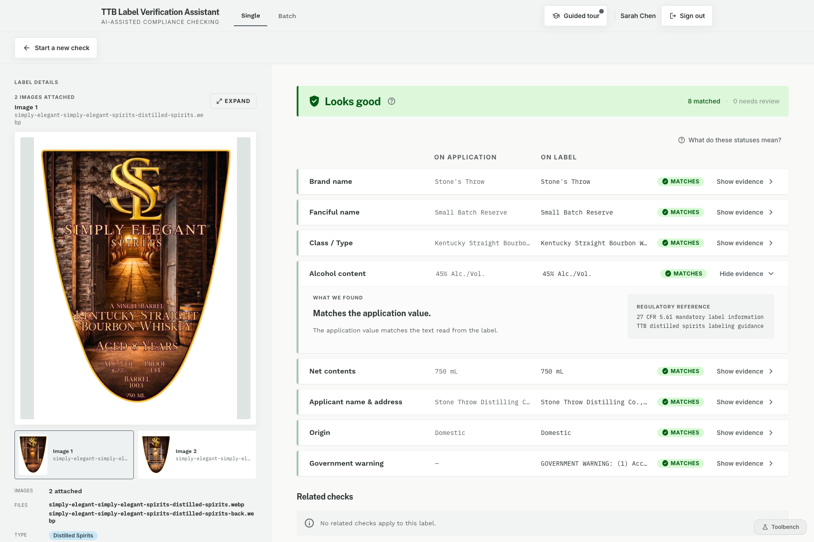
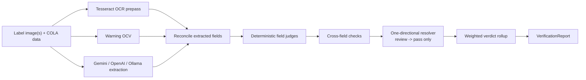
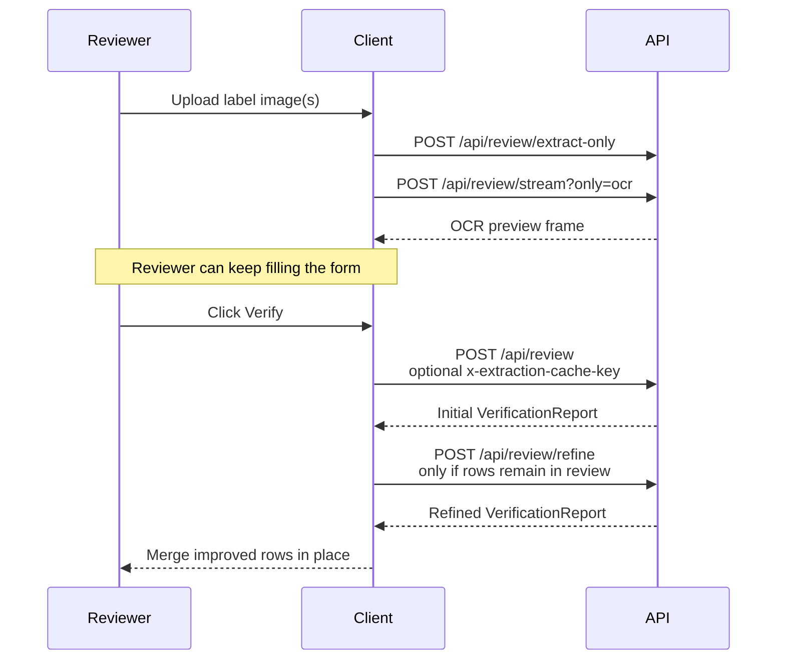

# TTB Label Verification

TTB Label Verification is a standalone proof-of-concept for the take-home brief: compare COLA application data against alcohol-beverage label imagery quickly enough to be usable in a real compliance queue, while keeping the final compliance decision deterministic and reviewer-owned.

Live demo: [Production](https://ttb-label-verification-production-f17b.up.railway.app) | [Staging](https://ttb-label-verification-staging.up.railway.app)

## Start Here

These are the submission entry points and should be read before digging through the rest of the repo:

- [Architecture And Decisions](docs/ARCHITECTURE_AND_DECISIONS.md): the system shape, the major engineering decisions, and why the prototype keeps AI on extraction while deterministic code owns the verdict.
- [Approach, Tools, Assumptions, Trade-Offs, And Limitations](docs/reference/submission-baseline.md): the brief submission note covering how the prototype was built, which runtime tools and development harnesses were used, what assumptions were filled independently, and where the current limits are.
- [Evaluator Guide](docs/EVALUATOR_GUIDE.md): the fastest route through the live prototype, Toolbench flows, refine behavior, and batch mode.

## Abstract

This submission treats the brief as a workflow and trust problem, not just a multimodal extraction demo. Gemini, OpenAI Responses, or local Qwen/Ollama paths extract structured facts; OCR and warning-specific checks contribute independent evidence; deterministic TypeScript validators decide the report; and the UI stays evidence-first so the reviewer keeps the final judgment. That is the central trade: lower false certainty and better reviewer trust, even when it means more `Needs review` outcomes on ambiguous labels.

The repo is also built to be evaluated, not just run. The README, architecture notes, evaluator guide, regulatory mapping, eval results, and demo script now act as one submission pack. They connect the stakeholder brief to concrete technical choices: COLA Cloud-backed dataset collection, a checked-in GoldenSet, spec-driven story packets, test-driven contracts and validators, trace-driven model tuning, local mode for government/firewall deployments, and a reviewer-friendly source layout that makes the engineering story easy to inspect.

## Why This Prototype Looks The Way It Does

The assignment pressure is not generic “build an AI app” pressure. It is a very specific operational shape:

- agents are spending time on repetitive visual matching work
- the tool loses credibility if a label takes 30 to 40 seconds to process
- veteran reviewers want evidence, not automation theater
- junior reviewers need guidance on what to inspect
- peak-season importers need batch handling, not just one-label demos

That is why the system is built around four product bets:

1. **AI extracts; deterministic rules judge.**
2. **Time-to-first-answer matters more than clever orchestration.**
3. **The UI should feel trustworthy across reviewer experience levels and tech comfort ranges.**
4. **The deployment story has to make sense in a government-style environment.**

## What An Assessor Should Look At

If you only have a few minutes, these are the highest-signal things to test:

1. **Single-label review**
   Open the lower-right `Toolbench`, load a sample label, watch the OCR preview arrive before the final report, and note that the output is evidence-rich instead of a black-box score.
2. **The refine pass**
   Leave a few ambiguous rows in `review` and watch the client quietly call `/api/review/refine` without blocking the first answer.
3. **Batch mode**
   Use `Toolbench -> Actions -> Open batch review`, then inspect the CSV-plus-many-images intake and the queue/drill-in path.
4. **Local / air-gapped mode**
   Read the local setup section and confirm the prototype can run without external API calls when configured that way.

## Evaluator Walkthrough

The fastest way to exercise the prototype is the built-in Toolbench in the lower-right corner. It is the evaluator harness for this repo: it loads known label samples, opens batch mode, resets the app, checks API health, and exposes dev-only provider overrides without forcing you to prepare files by hand.

The full screenshot-backed walkthrough lives in [docs/EVALUATOR_GUIDE.md](docs/EVALUATOR_GUIDE.md). Use that guide if you want a clean 5-minute test script for single review, refine behavior, Toolbench actions, and batch intake.

<p align="center">
  
  
</p>

## Architecture Summary

The central invariant is:

**AI extracts, rules judge.**

- provider adapters normalize Gemini, OpenAI Responses, or local Ollama/Qwen output into one typed extraction schema
- OCR prepass and warning-specific OCV act as independent evidence lanes
- deterministic TypeScript rules produce field checks, cross-field checks, and the final verdict
- reviewer-facing UI deliberately collapses internal `reject` into `Needs review` so the human remains accountable
- no upload or verification report is intended to be persisted; contracts carry `noPersistence: true`, and the OpenAI adapter enforces `store: false`



## The Refine Pass

The prototype does not stop at a single “best guess” result. After the initial `POST /api/review` response lands, the client can automatically fire a second-pass verification call to `/api/review/refine` when the rendered report still has rows in `review`.

This is deliberately **not** a replacement for the first answer:

- the first report stays on screen
- the refine pass is failure-tolerant and silent
- only the touched rows are merged back into the visible report
- the point is to improve trust on borderline rows without making the reviewer wait longer for the first answer

Mechanically, the refine pass works like this:

1. the initial review returns a normal `VerificationReport`
2. if the client sees refinable rows in `review`, it calls `/api/review/refine`
3. the server temporarily forces `VERIFICATION_MODE=on`
4. the review pipeline re-runs with the applicant-declared identifiers visible to the VLM
5. the refined report comes back and the client merges updated rows in place

That is useful because some of the hardest cases are not “the label is wrong,” but “the first pass could not confidently tell whether the declared brand / class / origin is actually visible on the label.”



Implementation seams:

- server route: [`src/server/routes/register-review-routes.ts`](src/server/routes/register-review-routes.ts)
- client request helper: [`src/client/appReviewApi.ts`](src/client/appReviewApi.ts)
- client orchestration: [`src/client/useSingleReviewFlow.ts`](src/client/useSingleReviewFlow.ts)
- row merge logic: [`src/client/useRefineReview.ts`](src/client/useRefineReview.ts)

## Code Layout

- `src/client/` stays UI-first and mostly flat so interaction work is easy to scan.
- `src/server/` now keeps only composition roots at the top level. Runtime code is grouped into shallow concern folders: `routes/`, `batch/`, `extractors/`, `review/`, `validators/`, `llm/`, `anchors/`, and `synthetic/`, alongside the existing `taxonomy/` and `testing/` areas.
- `scripts/` is organized by job instead of as one long shelf of utilities: `bootstrap/`, `git/`, `stitch/`, `quality/`, `data/`, `evals/`, `local/`, and `demo/`.
- The goal of that split is reviewer speed: top-level directories now answer “where do I start?” without burying the actual entrypoints behind deep nesting or barrel files.

## Perceived Latency vs Actual Latency

Latency is the adoption gate in the stakeholder interviews, so the prototype treats it as both a systems problem and a product problem.

- the best measured clean single-label trace landed around `4.36s` total, with roughly `4.35s` of that spent waiting on the provider
- the broader 28-label production-style run averaged about `5.2s`, which is why the docs separate contractual target from observed tail behavior on ambiguous labels
- the dominant cost is still provider wait time, not deterministic validation
- the app therefore tackles both **actual latency** and **perceived latency**

### How the app tackles perceived latency

| Tactic | What the reviewer experiences | Where it lives |
| --- | --- | --- |
| OCR preview | partial fields such as ABV, net contents, class, country, and warning presence appear while the full review is still running | [`src/client/useOcrPreview.ts`](src/client/useOcrPreview.ts), [`/api/review/stream?only=ocr`](src/client/appReviewApi.ts) |
| Extraction prefetch | image upload starts extraction during form-fill time, so Verify can skip the expensive extract step later | [`src/client/useExtractionPrefetch.ts`](src/client/useExtractionPrefetch.ts), [`/api/review/extract-only`](src/server/routes/register-review-routes.ts) |
| Speculative full prefetch | when the user pauses on a stable input, the client can pre-run the full review in the background and consume a cache hit at Verify time | [`src/client/useSpeculativePrefetch.ts`](src/client/useSpeculativePrefetch.ts) |
| Silent refine | the second-pass verification happens after the first answer lands, so borderline rows can improve without delaying the first render | [`src/client/useRefineReview.ts`](src/client/useRefineReview.ts), [`/api/review/refine`](src/server/routes/register-review-routes.ts) |

### How the app tackles actual latency

| Tactic | Why it helps | Where it lives |
| --- | --- | --- |
| Parallel fanout | OCR prepass, warning OCV, VLM extraction, and anchor search run together instead of serially | [`src/server/llm/llm-trace.ts`](src/server/llm/llm-trace.ts) |
| Boot warmup | primes Tesseract, sharp, OCR pipeline, and optional model/network connections before traffic starts | [`src/server/boot-warmup.ts`](src/server/boot-warmup.ts), [`src/server/index.ts`](src/server/index.ts) |
| Fast-fail fallback window | provider fallback is only attempted if the primary path fails quickly enough to still be worth it | [`src/server/review/review-latency.ts`](src/server/review/review-latency.ts), [`src/server/review/review-fallback-executor.ts`](src/server/review/review-fallback-executor.ts) |
| Stage-level timing | every request can emit a structured latency summary for diagnosis instead of anecdotal “it felt slow” reports | [`src/server/review/review-latency.ts`](src/server/review/review-latency.ts) |

### Latency decisions the prototype deliberately rejected

- Gemini streaming is implemented but **off by default** because the measured p95 tail was worse for the current single-label flow
- region detection is **off by default** because it added seconds of latency without enough accuracy gain
- the refine pass is **post-result**, not inline, because trust gains are not worth delaying the first answer

Detailed architectural writeups and eval evidence live here:

- [Architecture And Decisions](docs/ARCHITECTURE_AND_DECISIONS.md)
- [Approach, Tools, Assumptions, Trade-Offs, And Limitations](docs/reference/submission-baseline.md)
- [Government Warning](docs/GOVERNMENT_WARNING.md)
- [Regulatory Mapping](docs/REGULATORY_MAPPING.md)
- [Eval Results](docs/EVAL_RESULTS.md)
- [Railway / Ollama Setup](docs/process/RAILWAY_OLLAMA_SETUP.md)

## Quick Start (Cloud Mode)

### Prerequisites

- Node.js 20+
- npm 10+
- Tesseract OCR
  - macOS: `brew install tesseract`
  - Ubuntu/Debian: `sudo apt-get install tesseract-ocr tesseract-ocr-eng`

### Install

```bash
git clone <repo-url>
cd ttb-label-verification
npm install
npm run env:bootstrap
```

`npm run env:bootstrap` creates local env scaffolding if it is missing. The server auto-loads repo-local `.env` and `.env.local` outside tests.

### Configure

At minimum, set:

```bash
GEMINI_API_KEY=...
```

Optional cloud fallback / experimentation:

```bash
OPENAI_API_KEY=...
LLM_RESOLVER=enabled
```

### Run

```bash
npm run dev
```

Default local endpoints:

- UI: `http://127.0.0.1:5176`
- API: `http://127.0.0.1:8787`

Basic probes:

```bash
curl http://127.0.0.1:8787/api/health
curl http://127.0.0.1:8787/api/capabilities
```

What you should expect:

- `/api/health` reports liveness and whether the Responses API path is configured
- `/api/capabilities` reports whether local mode is allowed and what the default extraction mode is

## Local / Air-Gapped Mode

Local mode matters because the product docs target government deployment paths where public AI APIs may be disallowed or impractical inside a FedRAMP boundary. The deterministic validator is already local; this mode moves extraction local too.

### 1. Install local dependencies

- Node.js 20+
- npm 10+
- Tesseract OCR
- [Ollama](https://ollama.com/)

### 2. Pull the checked-in local model

```bash
ollama pull qwen2.5vl:3b
```

That tag matches the default used by the Ollama adapter.

### 3. Configure local extraction

Set these variables in `.env`:

```bash
AI_PROVIDER=local
AI_EXTRACTION_MODE_DEFAULT=local
AI_EXTRACTION_MODE_ALLOW_LOCAL=true
OLLAMA_HOST=http://127.0.0.1:11434
OLLAMA_VISION_MODEL=qwen2.5vl:3b
LLM_JUDGMENT=disabled
```

### 4. Enforce zero external API calls

For a strict air-gapped or government-style run:

1. do **not** set `GEMINI_API_KEY`
2. do **not** set `OPENAI_API_KEY`
3. keep outbound network egress blocked at the host or deployment boundary

Why that third step matters: the extractor factory itself defaults cross-mode fallback off, but the app wiring in `src/server/index.ts` is reliability-oriented and enables cross-mode fallback unless it is explicitly disabled by the caller. In practice, strict no-egress means “local mode plus no cloud credentials plus network policy,” not just “set `AI_PROVIDER=local`.”

### 5. Run and verify

```bash
npm run dev
curl http://127.0.0.1:8787/api/capabilities
```

You should see `defaultMode: "local"` when the environment is configured that way.

For more operational detail, see [docs/process/RAILWAY_OLLAMA_SETUP.md](docs/process/RAILWAY_OLLAMA_SETUP.md).

## Environment Variable Reference

The exhaustive checked-in example is [`.env.example`](.env.example). The tables below summarize the runtime knobs by purpose.

### Core runtime

| Variable | Purpose | Default / Notes |
| --- | --- | --- |
| `PORT` | API port | `8787` |
| `AI_PROVIDER` | provider family selector | `cloud` |
| `AI_EXTRACTION_MODE_DEFAULT` | default routing mode | `cloud` |
| `AI_EXTRACTION_MODE_ALLOW_LOCAL` | allow local-mode selection | `false` unless set |
| `TTB_BOOT_WARMUP` | disable extractor warmup when set to `disabled` | warmup enabled by default |
| `TTB_DEBUG_LATENCY` | enable verbose latency diagnostics | unset |
| `TTB_LOG_SERVER_EVENTS` | enable structured server-event logging | unset |
| `NODE_ENV` | runtime environment | `development` locally |

### Cloud providers

| Variable | Purpose | Default / Notes |
| --- | --- | --- |
| `GEMINI_API_KEY` | Gemini API key | required for Gemini cloud mode |
| `GEMINI_VISION_MODEL` | Gemini extraction model | `gemini-2.5-flash-lite` |
| `GEMINI_TIMEOUT_MS` | Gemini timeout | `5000` |
| `GEMINI_MEDIA_RESOLUTION` | Gemini media resolution hint | unset |
| `GEMINI_SERVICE_TIER` | Gemini service-tier hint | unset |
| `GEMINI_THINKING_BUDGET` | Gemini thinking budget override | model-aware default |
| `GEMINI_STREAM` | enable streaming path | off by default |
| `GEMINI_PRESCALE_EDGE` | optional raster prescale before Gemini | off by default |
| `OPENAI_API_KEY` | OpenAI Responses API key | optional cloud alternative |
| `OPENAI_MODEL` | default OpenAI model | `gpt-5.4-mini` |
| `OPENAI_VISION_MODEL` | OpenAI vision model | `gpt-5.4-mini` |
| `OPENAI_VISION_DETAIL` | OpenAI image detail hint | `auto` |
| `OPENAI_SERVICE_TIER` | OpenAI service-tier hint | unset |
| `OPENAI_STORE` | must remain `false` | enforced by code |
| `OPENAI_MAX_ATTEMPTS` | OpenAI retry cap | adapter default |

### Local extraction

| Variable | Purpose | Default / Notes |
| --- | --- | --- |
| `OLLAMA_HOST` | Ollama server URL | `http://127.0.0.1:11434` |
| `OLLAMA_VISION_MODEL` | local VLM tag | `qwen2.5vl:3b` |
| `OLLAMA_JUDGMENT_MODEL` | local text helper model | local-docs default; legacy path only |
| `OLLAMA_VLM_ENABLED` | force enable / disable Ollama VLM path | auto-detect |
| `TRANSFORMERS_LOCAL_MODEL` | local transformers model path | optional |
| `TRANSFORMERS_DTYPE` | local transformers dtype override | optional |
| `TRANSFORMERS_CACHE_DIR` | local model cache directory | optional |
| `TRANSFORMERS_CACHE_REQUIRED` | require cache-only local transformer mode | optional |

### Accuracy and policy controls

| Variable | Purpose | Default / Notes |
| --- | --- | --- |
| `LLM_RESOLVER` | enable review-only resolver | enabled in `.env.example`, off unless set in runtime env |
| `LLM_RESOLVER_THRESHOLD` | resolver confidence threshold | `0.60` |
| `LLM_JUDGMENT` | legacy broader LLM judgment layer | `disabled` |
| `ENABLE_SPIRITS_COLOCATION` | same-field-of-vision model check | auto |
| `SPIRITS_COLOCATION_MODEL` | colocation model override | inherits Gemini vision model |
| `SPIRITS_COLOCATION_TIMEOUT_MS` | colocation timeout | `8000` |
| `EXTRACTION_PIPELINE` | pipeline variant selector | multi-stage default |
| `EXTRACTION_FEW_SHOT` | enable few-shot appendix | off by default |
| `EXTRACTION_TRUSTED_TIER` | trusted-field set selector | expanded default |
| `OCR_VLM_CAP_CONFIDENCE` | cap for VLM-only OCR-friendly fields | `0.8` |
| `REGION_DETECTION` | enable experimental region detection | `disabled` |
| `ANCHOR_MERGE` | enable anchor merge path | unset |
| `VERIFICATION_MODE` | identifier-first verification experiment | `off` |

### Batch, eval, and tooling

| Variable | Purpose | Default / Notes |
| --- | --- | --- |
| `BATCH_CONCURRENCY` | concurrent labels in batch mode | `5`, clamped to `8` |
| `BATCH_RESOLVER_AGGREGATION` | aggregate resolver work across batch labels | `disabled` |
| `BASE_URL` | target API URL for eval scripts | `http://127.0.0.1:8787` |
| `EVAL_OUTPUT_PATH` | helper-script output path | optional |
| `EVAL_SETS` | eval-slice selector | optional |
| `OUTPUT_PATH` | generic helper output path | optional |
| `TIMEOUT_MS` | helper timeout override | optional |
| `VITE_ENABLE_EVAL_DEMO` | expose evaluator demo route | `1` in dev |
| `VITE_ENABLE_TOOLBENCH` | expose developer toolbench | optional |

### Evidence corpus and quality gates

- Current local verification on this branch: `99` test files and `579` passing tests, plus `npm run typecheck`, `npm run build`, and `npm run guard:source-size`.
- `evals/golden/manifest.json` is the canonical GoldenSet. It tracks the core-six smoke slice, the latency-twenty slice, cross-field dependencies, warning edge cases, batch cases, and failure-handling scenarios.
- `evals/labels/manifest.json` is the live image-backed quick subset used for faster smoke runs when a full GoldenSet pass is unnecessary.
- Public real-label coverage is assembled from COLA Cloud using [`scripts/data/fetch-cola-cloud-labels.ts`](scripts/data/fetch-cola-cloud-labels.ts), [`scripts/data/generate-cola-cloud-batch-fixtures.ts`](scripts/data/generate-cola-cloud-batch-fixtures.ts), and related helpers, then strengthened with synthetic negative cases via [`scripts/data/generate-supplemental-negative-labels.ts`](scripts/data/generate-supplemental-negative-labels.ts).
- Delivery is intentionally disciplined: spec-driven story packets define the scope, TDD guards contracts and validators, and trace-driven development is used for prompt and model tuning where deterministic tests are not enough.
- Codex owns the engineering lane and cloud/runtime integration; optional Claude/Stitch workflow tooling remains documented in process docs instead of being mixed into the runtime review path.

## Running Tests And Evals

Core engineering checks:

```bash
npm run test
npm run typecheck
npm run build
```

Eval-specific checks:

```bash
npm run evals:validate
npm run eval:golden
```

Useful supporting docs:

- [Eval Results](docs/EVAL_RESULTS.md)
- [Evaluator Guide](docs/EVALUATOR_GUIDE.md)
- [Demo Video Script](docs/DEMO_VIDEO_SCRIPT.md)
- [Trace-Driven Development](docs/process/TRACE_DRIVEN_DEVELOPMENT.md)
- [Test Quality Standard](docs/process/TEST_QUALITY_STANDARD.md)

## Project Structure

```text
src/
  client/                    Reviewer UI, batch UI, help surfaces
  server/                    Extractors, validators, routes, batch sessions, diagnostics
  shared/contracts/          Typed extraction/report/help contracts
docs/
  ARCHITECTURE_AND_DECISIONS.md
  GOVERNMENT_WARNING.md
  REGULATORY_MAPPING.md
  EVAL_RESULTS.md
  process/                   Delivery, testing, deploy, and workflow docs
  reference/product-docs/    Imported product and domain source material
evals/
  golden/                    Canonical scenario manifest
  labels/                    Live image-backed core-six subset
  results/                   Checked-in eval outputs
scripts/                     Eval helpers, bootstrap, stage-timing tools
```

## Deployment Notes

- `railway.toml` and `nixpacks.toml` are the checked-in deployment scaffolds
- `nixpacks.toml` installs Tesseract and keeps some experimental features off by default because they regressed latency or accuracy
- `/api/health` is a lightweight liveness/configuration endpoint, not a full provider readiness probe
- boot warmup exists to reduce cold-start pain, but first-request latency still depends heavily on the extractor provider

## What To Read Next

- [Architecture And Decisions](docs/ARCHITECTURE_AND_DECISIONS.md): the full system brief
- [ARCHITECTURE.md](ARCHITECTURE.md): directory map, domain groupings, where each concern lives
- [CONTRIBUTING.md](CONTRIBUTING.md): on-ramp for new contributors (humans and agents)
- [Evaluator Guide](docs/EVALUATOR_GUIDE.md): screenshot-backed reviewer test script and Toolbench walkthrough
- [Demo Video Script](docs/DEMO_VIDEO_SCRIPT.md): 5-8 minute submission walkthrough aligned to the evaluation criteria
- [Government Warning](docs/GOVERNMENT_WARNING.md): the most detailed single-rule deep dive
- [Regulatory Mapping](docs/REGULATORY_MAPPING.md): CFR-to-code traceability
- [Eval Results](docs/EVAL_RESULTS.md): model and pipeline evidence
- [Railway / Ollama Setup](docs/process/RAILWAY_OLLAMA_SETUP.md): operational setup notes
