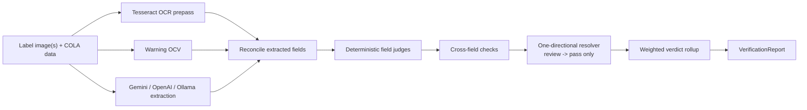
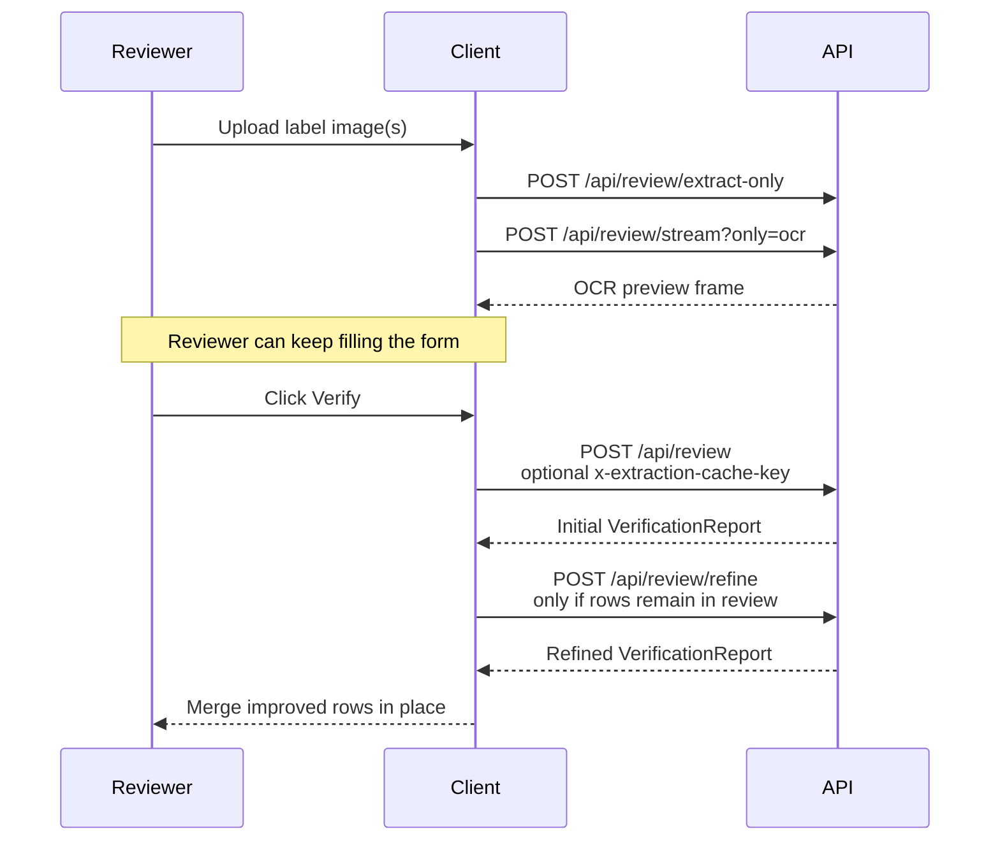

# TTB Label Verification

TTB Label Verification is a standalone proof-of-concept for the take-home brief: compare COLA application data against alcohol-beverage label imagery quickly enough to be usable in a real compliance queue, while keeping the final compliance decision deterministic and reviewer-owned.

Live demo: [Production](https://ttb-label-verification-production-f17b.up.railway.app) | [Staging](https://ttb-label-verification-staging.up.railway.app)

## Abstract

This prototype was built around one hard line: models are allowed to read, extract, and summarize label evidence, but they do not get to decide compliance. The live system uses typed extraction contracts, deterministic warning and field validators, cross-field rules, and a reviewer-facing UI that prefers explicit uncertainty over false confidence. That choice shapes everything else in the repo: the evidence-first results screen, the no-persistence posture, the latency work, the evaluator harness, the dataset strategy, and the cloud-versus-restricted-network tradeoff.

The most important technical choices are deliberate rather than flashy:

- **AI extracts; deterministic code judges.** Gemini, OpenAI Responses, and workstation-local paths normalize into one extraction contract, and the final verdict is computed in TypeScript rules.
- **Evidence beats automation theater.** The UI shows row-by-row evidence, warning sub-checks, citations, confidence, and reviewer-owned outcomes instead of a single opaque AI score.
- **Latency is treated as both systems work and product work.** OCR preview, extraction prefetch, silent refine, warmup, fallback budgeting, and stage timings all exist to improve both actual latency and perceived time-to-first-answer.
- **The evaluation corpus is part of the product.** Real approved labels, the checked-in golden set, the live core-six subset, the synthetic latency-twenty slice, and targeted benchmark artifacts are all first-class repo assets.
- **The deployment story is honest.** Cloud extraction is the strongest demonstrated path today; restricted-network/local mode exists because government firewalls and no-egress policies are real, but it is intentionally treated as a constrained operating posture with explicit tradeoffs.

## Why This Prototype Looks The Way It Does

The assignment pressure is not generic “build an AI app” pressure. It is a very specific operational shape:

- agents are spending time on repetitive visual matching work
- the tool loses credibility if a label takes 30 to 40 seconds to process
- veteran reviewers want evidence, not automation theater
- junior reviewers need guidance on what to inspect
- peak-season importers need batch handling, not just one-label demos

That is why the system is built around four product bets:

1. **AI extracts; deterministic rules judge.**
2. **Time-to-first-answer matters more than clever orchestration.**
3. **The UI should feel trustworthy to both experienced reviewers who want evidence fast and newer reviewers who need more guidance.**
4. **The deployment story has to make sense in a government-style environment.**

## Hidden Nuances From The Brief

The brief had a lot of requirements that were easy to miss if it was read as a generic AI demo prompt. This build treated those as design constraints:

| Hidden nuance in the discovery notes | Why it mattered | What the prototype did about it |
| --- | --- | --- |
| A previous scanning pilot took `30-40 s` per label and lost credibility | Performance is not a polish issue here; it is the adoption gate | Built both actual-latency work and perceived-latency work: OCR preview, extraction prefetch, warmup, stage timings, and tight fallback budgeting |
| Reviewers vary from highly experienced, evidence-driven users to newer staff who need guidance | The UI had to work for both skepticism and onboarding | Structured the results surface around severity ordering, expandable evidence, citations, confidence, and reviewer-owned `Needs review` outcomes |
| Obvious human-equivalent matches like `STONE'S THROW` vs `Stone's Throw` should not create brittle false mismatches | Strict string equality would fail the real workflow | Added deterministic comparison helpers and cosmetic-normalization logic instead of relying on raw OCR or model text alone |
| Government warning review is exacting and non-trivial | A generic OCR compare was not good enough | Built a dedicated warning validator with sub-checks, character-level diff evidence, visual-signal handling, and conservative review fallbacks |
| Poor photos, glare, cropping, and awkward angles are common | The system needed to fail conservatively, not hallucinate certainty | Combined OCR, VLM extraction, warning-specific OCV, image-quality states, and `review`-first fallback behavior |
| Government environments can block outbound calls and do not want persistent sensitive data | Deployment posture is part of the product, not an appendix | Kept the app standalone, enforced `store: false`, avoided persistence, and documented restricted-network/local mode explicitly |
| Peak-season importers submit labels in large batches | A single-label demo would miss a core operational need | Added batch preflight, batch execution, dashboard triage, drill-in review, retry, and export |

## What Makes This Build Credible

The strongest parts of the prototype are the parts that stay grounded when the AI is imperfect:

1. **Deterministic compliance core**
   Government warning validation, field matching, beverage-specific rules, cross-field checks, and verdict rollup all live outside the model path.
2. **A reviewer UI that protects trust**
   The results surface is structured for both expert and junior reviewers: severity ordering, expandable evidence, contextual help, and a reviewer-facing `Needs review` state instead of overclaiming rejection certainty.
3. **A realistic sample and benchmark strategy**
   Toolbench can load real approved labels, fetch fresh records through the COLA Cloud API, and drive the same checked-in evaluator scenarios used by the repo's golden-set workflow.
4. **A serious engineering workflow**
   The repo is not just code plus docs. It has a checked-in single source of truth, story packets, spec-driven delivery, test-driven development, trace-driven tuning, release-gate docs, and explicit Claude/Codex lane ownership.
5. **Honest tradeoffs**
   The cloud path is faster and better evidenced. The restricted-network/local posture exists because government deployments often block public model APIs, but it is presented as a bounded operating mode rather than a hand-waved checkbox.

## How We Turned The Brief Into An Execution Plan

The brief had explicit asks and a lot of implicit ones. We handled both in checked-in docs rather than leaving them as chat-only assumptions.

### Explicit requirements we implemented directly

- compare label imagery against optional COLA application fields
- keep the single-label path fast enough to feel usable in review work
- support batch review instead of only a one-label demo
- avoid persistence of uploads, application data, and results
- produce evaluator-facing documentation and a runnable deployed demo

### Implicit requirements we surfaced and treated as deliverables

- **Trust posture:** veteran reviewers need evidence, not AI bravado
- **Training posture:** junior reviewers need citations, sub-checks, and guidance
- **Operator posture:** government evaluators care about outbound calls, `store: false`, deployment realism, and firewalls
- **Dataset realism:** a demo-only happy-path corpus is not convincing, so the repo includes real-label samples, a golden-set manifest, a live core-six subset, and latency slices
- **Process rigor:** the repo needed to show how requirements became code, tests, evals, and release notes, not just the final UI

That execution contract now lives in the repo itself:

- `AGENTS.md` and `docs/process/SINGLE_SOURCE_OF_TRUTH.md` define the working model and story order
- `docs/specs/` records the product blueprint and story packets
- `docs/process/TEST_QUALITY_STANDARD.md` and `docs/process/TRACE_DRIVEN_DEVELOPMENT.md` document how we tuned accuracy and reliability
- `evals/` captures the canonical golden set, live subsets, and checked-in result artifacts
- `docs/reference/product-docs/` preserves the original source material that informed the implementation

## Documentation Map

If you are evaluating the repo rather than just the UI, start here:

- [Evaluator Guide](docs/EVALUATOR_GUIDE.md): fastest hands-on walkthrough of the running product
- [Architecture And Decisions](docs/ARCHITECTURE_AND_DECISIONS.md): architectural choices, tradeoffs, personas, and runtime seams
- [Eval Results](docs/EVAL_RESULTS.md): benchmark evidence, accuracy spread, latency artifacts, and model-path comparisons
- [Government Warning](docs/GOVERNMENT_WARNING.md): deepest single-rule implementation writeup
- [Regulatory Mapping](docs/REGULATORY_MAPPING.md): CFR-to-code traceability
- [Submission Baseline](docs/reference/submission-baseline.md): deliverables, assumptions, evaluation framing, and release posture
- [Full Product Spec](docs/specs/FULL_PRODUCT_SPEC.md): the checked-in product blueprint and story decomposition
- [Trace-Driven Development](docs/process/TRACE_DRIVEN_DEVELOPMENT.md): local-only prompt/model tuning loop
- [Test Quality Standard](docs/process/TEST_QUALITY_STANDARD.md): TDD, contract, property, and mutation expectations
- [Deployment Flow](docs/process/DEPLOYMENT_FLOW.md): GitHub/Railway delivery path and release gates

## Evaluation Criteria Coverage

This README is meant to let an evaluator map the brief directly to the implementation without hunting through the repo blindly.

| Evaluation criterion | What in this repo addresses it | Best places to inspect |
| --- | --- | --- |
| Correctness and completeness of core requirements | Single-label review, deterministic warning and field validation, batch mode, no-persistence posture, deployed app, evaluator harness | [Evaluator Guide](docs/EVALUATOR_GUIDE.md), [Architecture And Decisions](docs/ARCHITECTURE_AND_DECISIONS.md), [Submission Baseline](docs/reference/submission-baseline.md) |
| Code quality and organization | React/Express/Zod split, typed shared contracts, provider factory, isolated validators, batch/session boundaries, checked-in process docs | [`src/client/`](src/client), [`src/server/`](src/server), [`src/shared/contracts/`](src/shared/contracts), [Full Product Spec](docs/specs/FULL_PRODUCT_SPEC.md) |
| Appropriate technical choices for the scope | AI limited to extraction, deterministic code owns compliance outcomes, standalone proof-of-concept instead of premature COLA integration, cloud path benchmarked while local mode is documented honestly | [Architecture And Decisions](docs/ARCHITECTURE_AND_DECISIONS.md), [Eval Results](docs/EVAL_RESULTS.md), [Railway / Ollama Setup](docs/process/RAILWAY_OLLAMA_SETUP.md) |
| User experience and error handling | Trustworthy results surface, contextual help, upload validation, OCR preview, silent refine, batch drill-in, structured error contracts | [Evaluator Guide](docs/EVALUATOR_GUIDE.md), [`src/client/Results.tsx`](src/client/Results.tsx), [`src/server/index.test.ts`](src/server/index.test.ts) |
| Attention to requirements | `store: false`, no persistence, sub-5-second design target, batch support, firewall-aware local mode, evidence-first warning review, explicit assumptions and tradeoffs | [README](README.md), [Submission Baseline](docs/reference/submission-baseline.md), [Requirements Evidence Map](docs/reference/REQUIREMENTS_EVIDENCE_MAP.md) |
| Creative problem-solving | Toolbench evaluator harness, warning diff evidence, OCR/VLM reconciliation, extraction-prefetch cache, synthetic negatives derived from real approved labels, route-aware eval slices | [Evaluator Guide](docs/EVALUATOR_GUIDE.md), [Eval Results](docs/EVAL_RESULTS.md), [`scripts/fetch-cola-cloud-labels.ts`](scripts/fetch-cola-cloud-labels.ts), [`scripts/generate-supplemental-negative-labels.ts`](scripts/generate-supplemental-negative-labels.ts) |

## What An Assessor Should Look At

If you only have a few minutes, these are the highest-signal things to test:

1. **Single-label review with a tricky sample**
   Open the lower-right `Toolbench`, load `Pleasant Prairie Brewing Peach Sour Ale`, and verify that the result lands as evidence-rich `Needs review`, not as an overconfident pass/fail.
2. **Expanded warning evidence**
   Open the Government warning row and inspect the sub-checks, text comparison, and citations. This is the clearest example of the repo's “AI extracts, deterministic rules judge” stance.
3. **Dataset realism and sample sourcing**
   In Toolbench, use `Fetch live sample` to hit the COLA Cloud API or load a checked-in label from the curated corpus. The project was intentionally built around real approved labels, not only synthetic demos.
4. **Batch mode**
   Use `Toolbench -> Actions -> Open batch review`, then inspect the CSV-plus-many-images intake, queue filtering, drill-in, and export path.
5. **Restricted-network posture**
   Read the local/restricted-network section below and confirm the repo treats outbound cloud restrictions and firewall policy as first-class deployment constraints rather than afterthoughts.
6. **The docs themselves**
   Open the architecture and eval docs. Part of the submission value is that the repo explains the decisions, tradeoffs, datasets, and validation strategy in checked-in artifacts instead of asking the evaluator to infer them.

## Evaluator Walkthrough

The fastest way to exercise the prototype is the built-in Toolbench in the lower-right corner. It is the evaluator harness for this repo: it loads known label samples, opens batch mode, resets the app, checks API health, and exposes dev-only provider overrides without forcing you to prepare files by hand.

The full screenshot-backed walkthrough lives in [docs/EVALUATOR_GUIDE.md](docs/EVALUATOR_GUIDE.md). Use that guide if you want a clean 5-minute test script for single review, refine behavior, Toolbench actions, and batch intake.

<p align="center">
  
</p>

<p align="center">
  
</p>

## Datasets, Benchmarks, And Accuracy Strategy

Accuracy in this repo is not “trust the model and hope.” It is a layered evidence strategy:

- **A checked-in golden set of `75` cases** in [`evals/golden/manifest.json`](evals/golden/manifest.json) for canonical scenario coverage
- **A live core-six subset of `6` image-backed labels** in [`evals/labels/manifest.json`](evals/labels/manifest.json) for fast, repeatable single-label checks
- **A synthetic latency-twenty slice of `20` cases** for broader hot-path timing and benchmark comparison
- **A `cola-cloud-real` slice of `28` real approved labels** fetched through the COLA Cloud API across spirits, wine, and malt beverages
- **A `supplemental-negative` slice of `7` deterministic negatives** derived from real approved labels to pressure-test failure handling on realistic layouts
- **Structured eval artifacts** in [`evals/results/`](evals/results/) and [Eval Results](docs/EVAL_RESULTS.md) so accuracy and latency claims are inspectable

This matters because the project had to solve more than OCR. We had to find datasets that were credible, benchmark against the golden set, document the spread between runs, and make sure improvements were reflected in checked-in evidence instead of anecdotal screenshots.

### How the dataset was collected and shaped

1. **Started with evaluator-critical baselines.**
   The core-six slice was curated as the smallest believable evaluator baseline: happy path, warning defects, cosmetic mismatch, wine dependency failure, beer formatting issue, and low-quality-image behavior.
2. **Pulled real approved labels from COLA Cloud.**
   [`scripts/fetch-cola-cloud-labels.ts`](scripts/fetch-cola-cloud-labels.ts) searches the COLA Cloud API for diverse approved labels across all three beverage types, fetches detail views with product metadata, downloads label images, and emits manifest entries for integration into the golden set.
3. **Added realistic negatives instead of toy failures.**
   [`scripts/generate-supplemental-negative-labels.ts`](scripts/generate-supplemental-negative-labels.ts) derives controlled negative cases from real approved labels by injecting defects like warning occlusion, warning crops, and false ABV overlays.
4. **Normalized everything into one canonical manifest.**
   The golden manifest then organizes those cases into slices for beverage coverage, format compliance, deterministic comparison, cross-field dependencies, warning-edge work, standalone mode, batch flows, error handling, and endpoint-specific review/extraction/warning runs.

The result is a dataset strategy that is much closer to how an internal compliance team would evaluate procurement risk: not just “can the model read a label,” but “can the system survive real approved labels, realistic negatives, and the exact failure families that matter to reviewers.”

## Engineering Process

This repo was built with a deliberately heavy process spine because the brief had both product and evaluation weight.

- **Spec-driven delivery:** the product blueprint and story packets under `docs/specs/` make requirements executable instead of implicit
- **Test-driven development:** deterministic rules, shared contracts, and route boundaries are protected with repo-standard TDD expectations
- **Trace-driven tuning:** model and prompt changes are tuned locally against approved fixtures, not with external trace storage
- **Claude/Codex workflow split:** checked-in lane ownership keeps UI direction, engineering, validators, orchestration, and docs synchronized without hand-wavy ownership
- **Cloud + local workflow separation:** cloud extraction is the benchmarked primary path; restricted-network mode exists to answer government firewall realities without pretending the tradeoffs disappear

### Validation footprint

The current checked-in validation surface is intentionally broader than a typical take-home:

- `86` checked-in test and eval files across `src/`, `scripts/`, and `evals/`
- `565` listed Vitest cases in the current inventory spanning contracts, validators, routes, batch flows, help flows, UI state, and tooling
- `75` canonical golden cases in the full manifest
- `28` real approved COLA Cloud labels for realism beyond synthetic fixtures
- `7` supplemental negatives derived from real approved labels
- checked-in route, batch, latency, and model-comparison artifacts under [`evals/results/`](evals/results/) and [`docs/evals/`](docs/evals)

The result is that the repo explains not only **what** was built, but **how** requirements moved from source material to specs, from specs to tests, and from tests/evals into release-facing docs.

## Examples Of Depth And Critical Thinking

One of the easiest ways to tell whether this project was built with rigor is to look for places where the code chooses the conservative answer instead of the convenient one.

### 1. The contract itself encodes the privacy posture

This is not only README language. The extraction contract literally carries the no-persistence claim:

```ts
export const reviewExtractionSchema = z.object({
  extraction: reviewExtractionCoreSchema,
  noPersistence: z.literal(true),
  standaloneInverseLabelCheck: standaloneInverseLabelCheckSchema.optional()
});
```

That seam exists in [`src/shared/contracts/review-base.ts`](src/shared/contracts/review-base.ts), and the OpenAI path separately enforces `store: false` at the provider call boundary. The point is that privacy is expressed in both docs and runtime contracts, not left as a policy comment.

### 2. The model is intentionally prevented from becoming the judge

The report builder computes the verdict after extraction, not inside the model adapter:

```ts
const crossFieldChecks = buildCrossFieldChecks({ intake, extraction, spiritsColocation });
const verdictResult = deriveWeightedVerdict(checks, extraction.imageQuality, warningCheck);
```

That decision lives in [`src/server/review-report.ts`](src/server/review-report.ts). It is a strong critical-thinking choice because it makes the failure modes auditable: models can be wrong about what they saw, but the compliance logic stays deterministic, typed, and testable.

### 3. The repo prefers uncertainty over false certainty

The scoring path does not treat weak visual evidence as permission to pass. It explicitly forces review in uncertainty-heavy situations:

- low-confidence or weak warning evidence
- image-quality issues
- ambiguous same-field-of-vision or formatting judgments

The core logic is in [`src/server/judgment-scoring.ts`](src/server/judgment-scoring.ts) and [`src/server/review-report-cross-field.ts`](src/server/review-report-cross-field.ts). This is where the product shows real judgment: the safest failure mode for a reviewer tool is often `review`, not a fragile automated pass.

### 4. Provider flexibility was designed without letting the architecture drift

The provider-router seam means Gemini, OpenAI Responses, and restricted-network/local extraction can feed the same typed downstream pipeline:

- routing policy: [`src/server/ai-provider-policy.ts`](src/server/ai-provider-policy.ts)
- extractor factory: [`src/server/review-extractor-factory.ts`](src/server/review-extractor-factory.ts)
- shared extraction-output normalization: [`src/server/review-extraction-model-output.ts`](src/server/review-extraction-model-output.ts)

That is a deeper architectural move than “add another model.” It means the project can change extraction backends without rewriting the warning validator, field judges, batch engine, or UI report contract.

### 5. The government warning path was treated as a first-class reasoning problem

Instead of checking warning text with one coarse boolean, the repo breaks it into sub-checks, diff evidence, and regulatory references:

- validator: [`src/server/government-warning-validator.ts`](src/server/government-warning-validator.ts)
- sub-check logic: [`src/server/government-warning-subchecks.ts`](src/server/government-warning-subchecks.ts)
- UI evidence surface: [`src/client/WarningEvidence.tsx`](src/client/WarningEvidence.tsx)

That is why the results screen can explain *why* a warning landed in `Needs review` instead of only asserting that it failed.

### 6. The latency work shows product thinking, not just micro-optimization

The project does not talk about latency as one number. It separates:

- **perceived latency**: OCR preview, extraction prefetch, silent refine
- **actual latency**: warmup, provider fallback windows, stage timings

The supporting seams are visible in:

- [`src/client/useOcrPreview.ts`](src/client/useOcrPreview.ts)
- [`src/client/useExtractionPrefetch.ts`](src/client/useExtractionPrefetch.ts)
- [`src/client/useRefineReview.ts`](src/client/useRefineReview.ts)
- [`src/server/review-latency.ts`](src/server/review-latency.ts)

That split is a sign of strong critical thinking because the brief was about reviewer experience, not just benchmark vanity.

### 7. The repo treats evaluation as a design artifact, not a last-minute QA step

The golden set, live core-six subset, latency slice, and checked-in run artifacts are all part of the architecture:

- canonical corpus: [`evals/golden/manifest.json`](evals/golden/manifest.json)
- live subset: [`evals/labels/manifest.json`](evals/labels/manifest.json)
- timing/benchmark evidence: [docs/EVAL_RESULTS.md](docs/EVAL_RESULTS.md)
- process docs: [docs/process/TEST_QUALITY_STANDARD.md](docs/process/TEST_QUALITY_STANDARD.md) and [docs/process/TRACE_DRIVEN_DEVELOPMENT.md](docs/process/TRACE_DRIVEN_DEVELOPMENT.md)

That is one of the strongest signals in the repo: requirements were translated into datasets, eval slices, timing artifacts, and release-facing documentation, not only into feature tickets.

## Architecture Summary

The central invariant is:

**AI extracts, rules judge.**

- provider adapters normalize Gemini, OpenAI Responses, or local Ollama/Qwen output into one typed extraction schema
- OCR prepass and warning-specific OCV act as independent evidence lanes
- deterministic TypeScript rules produce field checks, cross-field checks, and the final verdict
- reviewer-facing UI deliberately collapses internal `reject` into `Needs review` so the human remains accountable
- no upload or verification report is intended to be persisted; contracts carry `noPersistence: true`, and the OpenAI adapter enforces `store: false`



## The Refine Pass

The prototype does not stop at a single “best guess” result. After the initial `POST /api/review` response lands, the client can automatically fire a second-pass verification call to `/api/review/refine` when the rendered report still has rows in `review`.

This is deliberately **not** a replacement for the first answer:

- the first report stays on screen
- the refine pass is failure-tolerant and silent
- only the touched rows are merged back into the visible report
- the point is to improve trust on borderline rows without making the reviewer wait longer for the first answer

Mechanically, the refine pass works like this:

1. the initial review returns a normal `VerificationReport`
2. if the client sees refinable rows in `review`, it calls `/api/review/refine`
3. the server temporarily forces `VERIFICATION_MODE=on`
4. the review pipeline re-runs with the applicant-declared identifiers visible to the VLM
5. the refined report comes back and the client merges updated rows in place

That is useful because some of the hardest cases are not “the label is wrong,” but “the first pass could not confidently tell whether the declared brand / class / origin is actually visible on the label.”



Implementation seams:

- server route: [`src/server/register-review-routes.ts`](src/server/register-review-routes.ts)
- client request helper: [`src/client/appReviewApi.ts`](src/client/appReviewApi.ts)
- client orchestration: [`src/client/useSingleReviewFlow.ts`](src/client/useSingleReviewFlow.ts)
- row merge logic: [`src/client/useRefineReview.ts`](src/client/useRefineReview.ts)

## Perceived Latency vs Actual Latency

Latency is the adoption gate in the stakeholder interviews, so the prototype treats it as both a systems problem and a product problem.

- the dominant cost is still provider wait time, not deterministic validation
- the app therefore tackles both **actual latency** and **perceived latency**
- current checked-in reference points are:
  - **actual latency:** the best 20-case `/api/review` run in [`docs/specs/TTB-209/performance-budget.md`](docs/specs/TTB-209/performance-budget.md) averaged `4946 ms`, with `4653 ms` median and `6013 ms` p95; the shipped `5000 ms` timeout profile averaged `4657 ms` with `4832 ms` median and `5018 ms` p95
  - **perceived latency:** OCR preview is documented at roughly `~500 ms` to `~1-2 s`, extraction-prefetch turns a cold `~5-7 s` verify into `<1 s` after enough form-fill time, and warm extraction-cache hits can collapse Verify to about `~100 ms`

### How the app tackles perceived latency

| Tactic | What the reviewer experiences | Where it lives |
| --- | --- | --- |
| OCR preview | partial fields such as ABV, net contents, class, country, and warning presence appear in roughly `~500 ms` on the happy path and about `~1-2 s` on slower OCR passes while the full review is still running | [`src/client/useOcrPreview.ts`](src/client/useOcrPreview.ts), [`src/client/useStreamingReview.ts`](src/client/useStreamingReview.ts), [`/api/review/stream?only=ocr`](src/client/appReviewApi.ts) |
| Extraction prefetch | image upload starts extraction during form-fill time, so a cold `~5-7 s` Verify can drop under `<1 s` once the reviewer has spent enough time on the form | [`src/client/useExtractionPrefetch.ts`](src/client/useExtractionPrefetch.ts), [`/api/review/extract-only`](src/server/register-review-routes.ts) |
| Speculative full prefetch | when the user pauses on a stable input, the client can pre-run the full review in the background and consume a warm cache hit; the pipeline comment calls out fast hits landing in about `600 ms` | [`src/client/useSpeculativePrefetch.ts`](src/client/useSpeculativePrefetch.ts), [`src/client/useSingleReviewPipeline.ts`](src/client/useSingleReviewPipeline.ts) |
| Silent refine | the second-pass verification happens after the first answer lands, so it adds `0 ms` to time-to-first-answer while still improving borderline rows later | [`src/client/useRefineReview.ts`](src/client/useRefineReview.ts), [`/api/review/refine`](src/server/register-review-routes.ts) |

### How the app tackles actual latency

| Tactic | Why it helps | Where it lives |
| --- | --- | --- |
| Parallel fanout | OCR prepass, warning OCV, VLM extraction, and anchor search run together instead of serially; the 2026-04-19 stage probe still showed provider wait as the dominant `~3.7-4.6 s` band | [`src/server/llm-trace.ts`](src/server/llm-trace.ts), [docs/EVAL_RESULTS.md](docs/EVAL_RESULTS.md) |
| Boot warmup | primes Tesseract, sharp, OCR pipeline, and optional model/network connections before traffic starts | [`src/server/boot-warmup.ts`](src/server/boot-warmup.ts), [`src/server/index.ts`](src/server/index.ts) |
| Fast-fail fallback window | provider fallback is only attempted if the primary path fails quickly enough to still be worth it; the cutoff stays at `550 ms` so a slow primary call does not trigger a late second full attempt | [`src/server/review-latency.ts`](src/server/review-latency.ts), [`src/server/review-fallback-executor.ts`](src/server/review-fallback-executor.ts) |
| Stage-level timing | every request can emit a structured latency summary for diagnosis instead of anecdotal “it felt slow” reports; the checked-in probe shows deterministic validation at only `0-6 ms`, OCR prepass at `298-1072 ms`, and warning OCV at `779-1100 ms` | [`src/server/review-latency.ts`](src/server/review-latency.ts), [docs/EVAL_RESULTS.md](docs/EVAL_RESULTS.md) |

### Latency decisions the prototype deliberately rejected

- Gemini streaming is implemented but **off by default** because the measured p95 tail was worse for the current single-label flow
- region detection is **off by default** because it added seconds of latency without enough accuracy gain
- the refine pass is **post-result**, not inline, because trust gains are not worth delaying the first answer

Detailed architectural writeups and eval evidence live here:

- [Architecture And Decisions](docs/ARCHITECTURE_AND_DECISIONS.md)
- [Government Warning](docs/GOVERNMENT_WARNING.md)
- [Regulatory Mapping](docs/REGULATORY_MAPPING.md)
- [Eval Results](docs/EVAL_RESULTS.md)
- [Railway / Ollama Setup](docs/process/RAILWAY_OLLAMA_SETUP.md)

## Quick Start (Cloud Mode)

### Prerequisites

- Node.js 20+
- npm 10+
- Tesseract OCR
  - macOS: `brew install tesseract`
  - Ubuntu/Debian: `sudo apt-get install tesseract-ocr tesseract-ocr-eng`

### Install

```bash
git clone <repo-url>
cd ttb-label-verification
npm install
npm run env:bootstrap
```

`npm run env:bootstrap` creates local env scaffolding if it is missing. The server auto-loads repo-local `.env` and `.env.local` outside tests.

### Configure

At minimum, set:

```bash
GEMINI_API_KEY=...
```

Optional cloud fallback / experimentation:

```bash
OPENAI_API_KEY=...
LLM_RESOLVER=enabled
```

### Run

```bash
npm run dev
```

Default local endpoints:

- UI: `http://127.0.0.1:5176`
- API: `http://127.0.0.1:8787`

Basic probes:

```bash
curl http://127.0.0.1:8787/api/health
curl http://127.0.0.1:8787/api/capabilities
```

What you should expect:

- `/api/health` reports liveness and whether the Responses API path is configured
- `/api/capabilities` reports whether local mode is allowed and what the default extraction mode is

## Local / Restricted-Network Mode

This mode exists because the product docs explicitly point to government deployment paths where public cloud model calls may be blocked by firewall policy, procurement rules, or no-egress requirements. The important point is architectural, not marketing: the deterministic validator is already local, so the extraction path can be swapped when the operating environment requires it.

Two cautions matter:

- the **best-evidenced reviewer path today is still cloud mode**
- restricted-network/local operation should be treated as a **bounded operating posture with lower-confidence visual claims and stricter operator setup**

That is why the prototype discusses local mode prominently while still keeping the benchmark and evaluator narrative anchored to the cloud path.

### 1. Install local dependencies

- Node.js 20+
- npm 10+
- Tesseract OCR
- [Ollama](https://ollama.com/)

### 2. Pull the checked-in local model

```bash
ollama pull qwen2.5vl:3b
```

That tag matches the default used by the Ollama adapter.

### 3. Configure local extraction

Set these variables in `.env`:

```bash
AI_PROVIDER=local
AI_EXTRACTION_MODE_DEFAULT=local
AI_EXTRACTION_MODE_ALLOW_LOCAL=true
OLLAMA_HOST=http://127.0.0.1:11434
OLLAMA_VISION_MODEL=qwen2.5vl:3b
LLM_JUDGMENT=disabled
```

### 4. Enforce zero external API calls

For a strict air-gapped or government-style run:

1. do **not** set `GEMINI_API_KEY`
2. do **not** set `OPENAI_API_KEY`
3. keep outbound network egress blocked at the host or deployment boundary

Why that third step matters: the extractor factory itself defaults cross-mode fallback off, but the app wiring in `src/server/index.ts` is reliability-oriented and enables cross-mode fallback unless it is explicitly disabled by the caller. In practice, strict no-egress means “local mode plus no cloud credentials plus network policy,” not just “set `AI_PROVIDER=local`.”

### 5. Run and verify

```bash
npm run dev
curl http://127.0.0.1:8787/api/capabilities
```

You should see `defaultMode: "local"` when the environment is configured that way.

For more operational detail, see [docs/process/RAILWAY_OLLAMA_SETUP.md](docs/process/RAILWAY_OLLAMA_SETUP.md).

## Environment Variable Reference

The exhaustive checked-in example is [`.env.example`](.env.example). The tables below summarize the runtime knobs by purpose.

### Core runtime

| Variable | Purpose | Default / Notes |
| --- | --- | --- |
| `PORT` | API port | `8787` |
| `AI_PROVIDER` | provider family selector | `cloud` |
| `AI_EXTRACTION_MODE_DEFAULT` | default routing mode | `cloud` |
| `AI_EXTRACTION_MODE_ALLOW_LOCAL` | allow local-mode selection | `false` unless set |
| `TTB_BOOT_WARMUP` | disable extractor warmup when set to `disabled` | warmup enabled by default |
| `TTB_DEBUG_LATENCY` | enable verbose latency diagnostics | unset |
| `TTB_LOG_SERVER_EVENTS` | enable structured server-event logging | unset |
| `NODE_ENV` | runtime environment | `development` locally |

### Cloud providers

| Variable | Purpose | Default / Notes |
| --- | --- | --- |
| `GEMINI_API_KEY` | Gemini API key | required for Gemini cloud mode |
| `GEMINI_VISION_MODEL` | Gemini extraction model | `gemini-2.5-flash-lite` |
| `GEMINI_TIMEOUT_MS` | Gemini timeout | `5000` |
| `GEMINI_MEDIA_RESOLUTION` | Gemini media resolution hint | unset |
| `GEMINI_SERVICE_TIER` | Gemini service-tier hint | unset |
| `GEMINI_THINKING_BUDGET` | Gemini thinking budget override | model-aware default |
| `GEMINI_STREAM` | enable streaming path | off by default |
| `GEMINI_PRESCALE_EDGE` | optional raster prescale before Gemini | off by default |
| `OPENAI_API_KEY` | OpenAI Responses API key | optional cloud alternative |
| `OPENAI_MODEL` | default OpenAI model | `gpt-5.4-mini` |
| `OPENAI_VISION_MODEL` | OpenAI vision model | `gpt-5.4-mini` |
| `OPENAI_VISION_DETAIL` | OpenAI image detail hint | `auto` |
| `OPENAI_SERVICE_TIER` | OpenAI service-tier hint | unset |
| `OPENAI_STORE` | must remain `false` | enforced by code |
| `OPENAI_MAX_ATTEMPTS` | OpenAI retry cap | adapter default |

### Local extraction

| Variable | Purpose | Default / Notes |
| --- | --- | --- |
| `OLLAMA_HOST` | Ollama server URL | `http://127.0.0.1:11434` |
| `OLLAMA_VISION_MODEL` | local VLM tag | `qwen2.5vl:3b` |
| `OLLAMA_JUDGMENT_MODEL` | local text helper model | local-docs default; legacy path only |
| `OLLAMA_VLM_ENABLED` | force enable / disable Ollama VLM path | auto-detect |
| `TRANSFORMERS_LOCAL_MODEL` | local transformers model path | optional |
| `TRANSFORMERS_DTYPE` | local transformers dtype override | optional |
| `TRANSFORMERS_CACHE_DIR` | local model cache directory | optional |
| `TRANSFORMERS_CACHE_REQUIRED` | require cache-only local transformer mode | optional |

### Accuracy and policy controls

| Variable | Purpose | Default / Notes |
| --- | --- | --- |
| `LLM_RESOLVER` | enable review-only resolver | enabled in `.env.example`, off unless set in runtime env |
| `LLM_RESOLVER_THRESHOLD` | resolver confidence threshold | `0.60` |
| `LLM_JUDGMENT` | legacy broader LLM judgment layer | `disabled` |
| `ENABLE_SPIRITS_COLOCATION` | same-field-of-vision model check | auto |
| `SPIRITS_COLOCATION_MODEL` | colocation model override | inherits Gemini vision model |
| `SPIRITS_COLOCATION_TIMEOUT_MS` | colocation timeout | `8000` |
| `EXTRACTION_PIPELINE` | pipeline variant selector | multi-stage default |
| `EXTRACTION_FEW_SHOT` | enable few-shot appendix | off by default |
| `EXTRACTION_TRUSTED_TIER` | trusted-field set selector | expanded default |
| `OCR_VLM_CAP_CONFIDENCE` | cap for VLM-only OCR-friendly fields | `0.8` |
| `REGION_DETECTION` | enable experimental region detection | `disabled` |
| `ANCHOR_MERGE` | enable anchor merge path | unset |
| `VERIFICATION_MODE` | identifier-first verification experiment | `off` |

### Batch, eval, and tooling

| Variable | Purpose | Default / Notes |
| --- | --- | --- |
| `BATCH_CONCURRENCY` | concurrent labels in batch mode | `5`, clamped to `8` |
| `BATCH_RESOLVER_AGGREGATION` | aggregate resolver work across batch labels | `disabled` |
| `BASE_URL` | target API URL for eval scripts | `http://127.0.0.1:8787` |
| `EVAL_OUTPUT_PATH` | helper-script output path | optional |
| `EVAL_SETS` | eval-slice selector | optional |
| `OUTPUT_PATH` | generic helper output path | optional |
| `TIMEOUT_MS` | helper timeout override | optional |
| `VITE_ENABLE_EVAL_DEMO` | expose evaluator demo route | `1` in dev |
| `VITE_ENABLE_TOOLBENCH` | expose developer toolbench | optional |

### Validation and dataset snapshot

This is a better summary of repo quality than the internal story-workflow variables:

| Asset | Current footprint | Why it exists |
| --- | --- | --- |
| Automated tests and eval files | `86` files | protects contracts, validators, routes, UI state, batch flows, and tooling seams |
| Listed Vitest cases | `565` | makes the TDD posture concrete instead of implied |
| Golden manifest | `75` cases | canonical source of truth for scenario coverage |
| Live evaluator subset | `6` image-backed cases | fastest believable demo and smoke-regression slice |
| Real approved label corpus | `28` COLA Cloud labels | proves the app works on genuine approved records, not only hand-made fixtures |
| Supplemental negatives | `7` cases | pressure-tests realistic failure handling on top of real-label layouts |
| Latency benchmark slice | `20` cases | keeps hot-path tuning honest and reproducible |

If you want the underlying collection and evaluation details rather than the summary, open:

- [evals/README.md](evals/README.md)
- [Eval Results](docs/EVAL_RESULTS.md)
- [Submission Baseline](docs/reference/submission-baseline.md)
- [Architecture And Decisions](docs/ARCHITECTURE_AND_DECISIONS.md)

## Running Tests And Evals

Core engineering checks:

```bash
npm run test
npm run typecheck
npm run build
```

Eval-specific checks:

```bash
npm run evals:validate
npm run eval:golden
```

Useful supporting docs:

- [Eval Results](docs/EVAL_RESULTS.md)
- [Evaluator Guide](docs/EVALUATOR_GUIDE.md)
- [Trace-Driven Development](docs/process/TRACE_DRIVEN_DEVELOPMENT.md)
- [Test Quality Standard](docs/process/TEST_QUALITY_STANDARD.md)

## Project Structure

```text
src/
  client/                    Reviewer UI, batch UI, help surfaces
  server/                    Extractors, validators, routes, batch sessions, diagnostics
  shared/contracts/          Typed extraction/report/help contracts
docs/
  ARCHITECTURE_AND_DECISIONS.md
  GOVERNMENT_WARNING.md
  REGULATORY_MAPPING.md
  EVAL_RESULTS.md
  process/                   Delivery, testing, deploy, and workflow docs
  reference/product-docs/    Imported product and domain source material
evals/
  golden/                    Canonical scenario manifest
  labels/                    Live image-backed core-six subset
  results/                   Checked-in eval outputs
scripts/                     Eval helpers, bootstrap, stage-timing tools
```

## Deployment Notes

- `railway.toml` and `nixpacks.toml` are the checked-in deployment scaffolds
- `nixpacks.toml` installs Tesseract and keeps some experimental features off by default because they regressed latency or accuracy
- `/api/health` is a lightweight liveness/configuration endpoint, not a full provider readiness probe
- boot warmup exists to reduce cold-start pain, but first-request latency still depends heavily on the extractor provider

## What To Read Next

- [Architecture And Decisions](docs/ARCHITECTURE_AND_DECISIONS.md): the full system brief
- [ARCHITECTURE.md](ARCHITECTURE.md): directory map, domain groupings, where each concern lives
- [CONTRIBUTING.md](CONTRIBUTING.md): on-ramp for new contributors (humans and agents)
- [Evaluator Guide](docs/EVALUATOR_GUIDE.md): screenshot-backed reviewer test script and Toolbench walkthrough
- [Government Warning](docs/GOVERNMENT_WARNING.md): the most detailed single-rule deep dive
- [Regulatory Mapping](docs/REGULATORY_MAPPING.md): CFR-to-code traceability
- [Eval Results](docs/EVAL_RESULTS.md): model and pipeline evidence
- [Railway / Ollama Setup](docs/process/RAILWAY_OLLAMA_SETUP.md): operational setup notes
