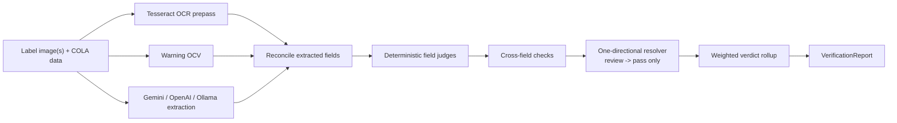

# TTB Label Verification

TTB Label Verification is a proof-of-concept review system for comparing COLA Form 5100.31 application data against alcohol beverage label images. The architecture is intentionally narrow: AI extracts structured facts from the label, deterministic code validates those facts against application data and regulatory rules, and the product surfaces `approve`, `review`, or `reject` without pretending the model made the compliance decision.

Live demo: [Production](https://ttb-label-verification-production-f17b.up.railway.app) | [Staging](https://ttb-label-verification-staging.up.railway.app)

## Architecture Summary

The central invariant is:

**AI extracts, rules judge.**

- provider adapters normalize Gemini, OpenAI Responses, or local Ollama/Qwen output into one typed extraction schema
- OCR prepass and warning-specific OCV act as independent evidence lanes
- deterministic TypeScript rules produce field checks, cross-field checks, and the final verdict
- reviewer-facing UI deliberately collapses internal `reject` into `Needs review` so the human remains accountable
- no upload or verification report is intended to be persisted; contracts carry `noPersistence: true`, and the OpenAI adapter enforces `store: false`



The full architectural narrative, regulatory mapping, warning deep dive, and eval history live here:

- [Architecture And Decisions](docs/ARCHITECTURE_AND_DECISIONS.md)
- [Government Warning](docs/GOVERNMENT_WARNING.md)
- [Regulatory Mapping](docs/REGULATORY_MAPPING.md)
- [Eval Results](docs/EVAL_RESULTS.md)
- [Railway / Ollama Setup](docs/process/RAILWAY_OLLAMA_SETUP.md)

## Quick Start (Cloud Mode)

### Prerequisites

- Node.js 20+
- npm 10+
- Tesseract OCR
  - macOS: `brew install tesseract`
  - Ubuntu/Debian: `sudo apt-get install tesseract-ocr tesseract-ocr-eng`

### Install

```bash
git clone <repo-url>
cd ttb-label-verification
npm install
npm run env:bootstrap
```

`npm run env:bootstrap` creates local env scaffolding if it is missing. The server auto-loads repo-local `.env` and `.env.local` outside tests.

### Configure

At minimum, set:

```bash
GEMINI_API_KEY=...
```

Optional cloud fallback / experimentation:

```bash
OPENAI_API_KEY=...
LLM_RESOLVER=enabled
```

### Run

```bash
npm run dev
```

Default local endpoints:

- UI: `http://127.0.0.1:5176`
- API: `http://127.0.0.1:8787`

Basic probes:

```bash
curl http://127.0.0.1:8787/api/health
curl http://127.0.0.1:8787/api/capabilities
```

What you should expect:

- `/api/health` reports liveness and whether the Responses API path is configured
- `/api/capabilities` reports whether local mode is allowed and what the default extraction mode is

## Local / Air-Gapped Mode

Local mode matters because the product docs target government deployment paths where public AI APIs may be disallowed or impractical inside a FedRAMP boundary. The deterministic validator is already local; this mode moves extraction local too.

### 1. Install local dependencies

- Node.js 20+
- npm 10+
- Tesseract OCR
- [Ollama](https://ollama.com/)

### 2. Pull the checked-in local model

```bash
ollama pull qwen2.5vl:3b
```

That tag matches the default used by the Ollama adapter.

### 3. Configure local extraction

Set these variables in `.env`:

```bash
AI_PROVIDER=local
AI_EXTRACTION_MODE_DEFAULT=local
AI_EXTRACTION_MODE_ALLOW_LOCAL=true
OLLAMA_HOST=http://127.0.0.1:11434
OLLAMA_VISION_MODEL=qwen2.5vl:3b
LLM_JUDGMENT=disabled
```

### 4. Enforce zero external API calls

For a strict air-gapped or government-style run:

1. do **not** set `GEMINI_API_KEY`
2. do **not** set `OPENAI_API_KEY`
3. keep outbound network egress blocked at the host or deployment boundary

Why that third step matters: the extractor factory itself defaults cross-mode fallback off, but the app wiring in `src/server/index.ts` is reliability-oriented and enables cross-mode fallback unless it is explicitly disabled by the caller. In practice, strict no-egress means “local mode plus no cloud credentials plus network policy,” not just “set `AI_PROVIDER=local`.”

### 5. Run and verify

```bash
npm run dev
curl http://127.0.0.1:8787/api/capabilities
```

You should see `defaultMode: "local"` when the environment is configured that way.

For more operational detail, see [docs/process/RAILWAY_OLLAMA_SETUP.md](docs/process/RAILWAY_OLLAMA_SETUP.md).

## Environment Variable Reference

The exhaustive checked-in example is [`.env.example`](.env.example). The tables below summarize the runtime knobs by purpose.

### Core runtime

| Variable | Purpose | Default / Notes |
| --- | --- | --- |
| `PORT` | API port | `8787` |
| `AI_PROVIDER` | provider family selector | `cloud` |
| `AI_EXTRACTION_MODE_DEFAULT` | default routing mode | `cloud` |
| `AI_EXTRACTION_MODE_ALLOW_LOCAL` | allow local-mode selection | `false` unless set |
| `TTB_BOOT_WARMUP` | disable extractor warmup when set to `disabled` | warmup enabled by default |
| `TTB_DEBUG_LATENCY` | enable verbose latency diagnostics | unset |
| `TTB_LOG_SERVER_EVENTS` | enable structured server-event logging | unset |
| `NODE_ENV` | runtime environment | `development` locally |

### Cloud providers

| Variable | Purpose | Default / Notes |
| --- | --- | --- |
| `GEMINI_API_KEY` | Gemini API key | required for Gemini cloud mode |
| `GEMINI_VISION_MODEL` | Gemini extraction model | `gemini-2.5-flash-lite` |
| `GEMINI_TIMEOUT_MS` | Gemini timeout | `5000` |
| `GEMINI_MEDIA_RESOLUTION` | Gemini media resolution hint | unset |
| `GEMINI_SERVICE_TIER` | Gemini service-tier hint | unset |
| `GEMINI_THINKING_BUDGET` | Gemini thinking budget override | model-aware default |
| `GEMINI_STREAM` | enable streaming path | off by default |
| `GEMINI_PRESCALE_EDGE` | optional raster prescale before Gemini | off by default |
| `OPENAI_API_KEY` | OpenAI Responses API key | optional cloud alternative |
| `OPENAI_MODEL` | default OpenAI model | `gpt-5.4-mini` |
| `OPENAI_VISION_MODEL` | OpenAI vision model | `gpt-5.4-mini` |
| `OPENAI_VISION_DETAIL` | OpenAI image detail hint | `auto` |
| `OPENAI_SERVICE_TIER` | OpenAI service-tier hint | unset |
| `OPENAI_STORE` | must remain `false` | enforced by code |
| `OPENAI_MAX_ATTEMPTS` | OpenAI retry cap | adapter default |

### Local extraction

| Variable | Purpose | Default / Notes |
| --- | --- | --- |
| `OLLAMA_HOST` | Ollama server URL | `http://127.0.0.1:11434` |
| `OLLAMA_VISION_MODEL` | local VLM tag | `qwen2.5vl:3b` |
| `OLLAMA_JUDGMENT_MODEL` | local text helper model | local-docs default; legacy path only |
| `OLLAMA_VLM_ENABLED` | force enable / disable Ollama VLM path | auto-detect |
| `TRANSFORMERS_LOCAL_MODEL` | local transformers model path | optional |
| `TRANSFORMERS_DTYPE` | local transformers dtype override | optional |
| `TRANSFORMERS_CACHE_DIR` | local model cache directory | optional |
| `TRANSFORMERS_CACHE_REQUIRED` | require cache-only local transformer mode | optional |

### Accuracy and policy controls

| Variable | Purpose | Default / Notes |
| --- | --- | --- |
| `LLM_RESOLVER` | enable review-only resolver | enabled in `.env.example`, off unless set in runtime env |
| `LLM_RESOLVER_THRESHOLD` | resolver confidence threshold | `0.60` |
| `LLM_JUDGMENT` | legacy broader LLM judgment layer | `disabled` |
| `ENABLE_SPIRITS_COLOCATION` | same-field-of-vision model check | auto |
| `SPIRITS_COLOCATION_MODEL` | colocation model override | inherits Gemini vision model |
| `SPIRITS_COLOCATION_TIMEOUT_MS` | colocation timeout | `8000` |
| `EXTRACTION_PIPELINE` | pipeline variant selector | multi-stage default |
| `EXTRACTION_FEW_SHOT` | enable few-shot appendix | off by default |
| `EXTRACTION_TRUSTED_TIER` | trusted-field set selector | expanded default |
| `OCR_VLM_CAP_CONFIDENCE` | cap for VLM-only OCR-friendly fields | `0.8` |
| `REGION_DETECTION` | enable experimental region detection | `disabled` |
| `ANCHOR_MERGE` | enable anchor merge path | unset |
| `VERIFICATION_MODE` | identifier-first verification experiment | `off` |

### Batch, tracing, and tooling

| Variable | Purpose | Default / Notes |
| --- | --- | --- |
| `BATCH_CONCURRENCY` | concurrent labels in batch mode | `5`, clamped to `8` |
| `BATCH_RESOLVER_AGGREGATION` | aggregate resolver work across batch labels | `disabled` |
| `LANGSMITH_API_KEY` | LangSmith tracing key | dev/eval only |
| `LANGSMITH_PROJECT` | LangSmith project name | `ttb-label-verification-dev` |
| `LANGSMITH_TRACING` | enable tracing | `false` by default |
| `BASE_URL` | target API URL for eval scripts | `http://127.0.0.1:8787` |
| `EVAL_OUTPUT_PATH` | helper-script output path | optional |
| `EVAL_SETS` | eval-slice selector | optional |
| `OUTPUT_PATH` | generic helper output path | optional |
| `TIMEOUT_MS` | helper timeout override | optional |
| `VITE_ENABLE_EVAL_DEMO` | expose evaluator demo route | `1` in dev |
| `VITE_ENABLE_TOOLBENCH` | expose developer toolbench | optional |

### Story / UI workflow tooling

These are not required for runtime review, but they are documented in the repo and surfaced in `.env.example`.

| Variable | Purpose |
| --- | --- |
| `STITCH_FLOW_MODE` | Claude/Stitch workflow mode |
| `STITCH_API_KEY` | Stitch API key |
| `STITCH_ACCESS_TOKEN` | Stitch access token |
| `STITCH_PROJECT_ID` | Stitch project id |
| `STITCH_PROJECT_TITLE` | Stitch project display name |
| `STITCH_MODEL_ID` | Stitch model id |
| `STITCH_DEVICE_TYPE` | Stitch device target |
| `STITCH_AUTOMATION_REVIEW_REQUIRED` | require human review for Stitch automation |
| `STITCH_GENERATION_TIMEOUT_MS` | Stitch generation timeout |
| `STITCH_DOWNLOAD_TIMEOUT_MS` | Stitch download timeout |
| `STITCH_POLL_INTERVAL_MS` | Stitch poll interval |
| `STITCH_POLL_TIMEOUT_MS` | Stitch poll timeout |

## Running Tests And Evals

Core engineering checks:

```bash
npm run test
npm run typecheck
npm run build
```

Eval-specific checks:

```bash
npm run evals:validate
npm run eval:golden
```

Tracing / provider smoke:

```bash
npm run langsmith:smoke
```

Useful supporting docs:

- [Eval Results](docs/EVAL_RESULTS.md)
- [Trace-Driven Development](docs/process/TRACE_DRIVEN_DEVELOPMENT.md)
- [Test Quality Standard](docs/process/TEST_QUALITY_STANDARD.md)

## Project Structure

```text
src/
  client/                    Reviewer UI, batch UI, help surfaces
  server/                    Extractors, validators, routes, batch sessions, diagnostics
  shared/contracts/          Typed extraction/report/help contracts
docs/
  ARCHITECTURE_AND_DECISIONS.md
  GOVERNMENT_WARNING.md
  REGULATORY_MAPPING.md
  EVAL_RESULTS.md
  process/                   Delivery, testing, deploy, and workflow docs
  reference/product-docs/    Imported product and domain source material
evals/
  golden/                    Canonical scenario manifest
  labels/                    Live image-backed core-six subset
  results/                   Checked-in eval outputs
scripts/                     Eval helpers, bootstrap, stage-timing tools
```

## Deployment Notes

- `railway.toml` and `nixpacks.toml` are the checked-in deployment scaffolds
- `nixpacks.toml` installs Tesseract and keeps some experimental features off by default because they regressed latency or accuracy
- `/api/health` is a lightweight liveness/configuration endpoint, not a full provider readiness probe
- boot warmup exists to reduce cold-start pain, but first-request latency still depends heavily on the extractor provider

## What To Read Next

- [Architecture And Decisions](docs/ARCHITECTURE_AND_DECISIONS.md): the full system brief
- [Government Warning](docs/GOVERNMENT_WARNING.md): the most detailed single-rule deep dive
- [Regulatory Mapping](docs/REGULATORY_MAPPING.md): CFR-to-code traceability
- [Eval Results](docs/EVAL_RESULTS.md): model and pipeline evidence
- [Railway / Ollama Setup](docs/process/RAILWAY_OLLAMA_SETUP.md): operational setup notes
