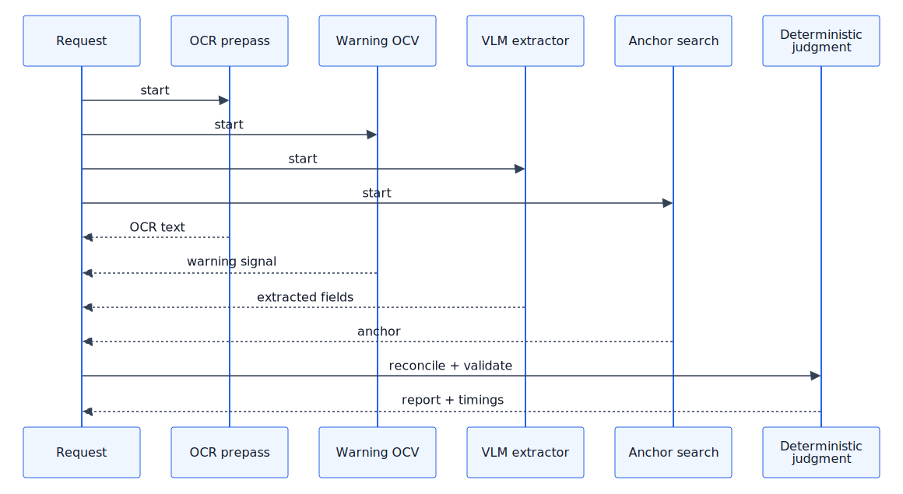

# Architecture And Decisions

This document explains how the repository thinks about TTB label review. It is grounded in checked-in code, contracts, eval artifacts, and product docs. The long question list that prompted this writeup is treated here as a coverage checklist, not as the outward structure of the document.

Two scope notes matter up front.

1. Runtime code wins over older planning prose. The live contract currently sets the single-label latency budget to `4000ms` in `src/shared/contracts/review-base.ts:59,287-300`, even though older TTB-209 trace notes and some historical docs discuss a `5000ms` target (`docs/specs/TTB-209/trace-brief.md:57-59`).
2. The repo is intentionally conservative about claims. Where a regulation is only partially encoded, or where a product aspiration exists in docs but not in runtime code, that gap is called out explicitly instead of being papered over.

Related documents:

- [README.md](../README.md)
- [Government Warning](./GOVERNMENT_WARNING.md)
- [Regulatory Mapping](./REGULATORY_MAPPING.md)
- [Eval Results](./EVAL_RESULTS.md)

## The System As A Human Workflow

This repository is not trying to replace TTB reviewers with a generic document agent. It is built as a comparison engine for a specific review task: compare COLA-declared data to what is physically present on a submitted alcohol label, separate the easy matches from the risky or ambiguous cases, and keep the human reviewer in charge when the evidence is weak. That framing comes straight from the product docs and shows up in the runtime shape of the app. The persona source material defines five distinct users with different stakes: Sarah the throughput owner, Dave the 28-year veteran reviewer, Jenny the junior reviewer, Marcus the IT administrator, and Janet the batch operator (`docs/reference/product-docs/ttb-user-personas.md:7-70,74-148,151-229,233-257`; `docs/reference/product-docs/ttb-prd-comprehensive.md:45-57,515,560,583`). The code serves those personas differently rather than pretending they all want the same thing.

| User | What they need | Architectural response |
| --- | --- | --- |
| Sarah, leadership / throughput owner | Faster routine review without losing safety credibility | Three-tier verdicts, deterministic rules, explicit citations, and batch metrics rather than opaque AI scoring (`src/server/judgment-scoring.ts:13-252`; `src/server/batch-session.ts:209-254`) |
| Dave, veteran reviewer | A tool that stays out of his way and does not insult obvious human judgment | UI copy collapses internal `reject` into reviewer-facing `Needs review`, sorts actionable mismatches first, and preserves raw evidence panels instead of making broad claims (`src/client/reviewDisplayAdapter.ts:27-38,63-103`; `src/client/Results.tsx:112-125,266-375`) |
| Jenny, junior reviewer | Guidance on what matters and why | Severity ordering, confidence indicators, warning subchecks, citations, and contextual help (`src/client/Results.tsx:61-125,279-365`; `src/client/WarningEvidence.tsx:20-119`; `src/client/ConfidenceMeter.tsx:9-83`; `src/shared/help-fixture.ts:63-128`) |
| Janet, batch reviewer | High-throughput queue triage across many labels | Preflight + streaming batch sessions, retry/export, filterable dashboard, and concurrency control (`src/server/register-batch-routes.ts:54-187`; `src/server/batch-session.ts:73-398`; `src/client/BatchDashboardControls.tsx:9-208`) |
| Marcus, IT administrator | Deployable, diagnosable software without the original author present | `.env.example`, health/capabilities routes, Railway/Nixpacks scaffolding, local mode, and explicit no-persistence contract language (`.env.example:1-95`; `src/server/register-app-routes.ts:34-83`; `railway.toml:1-18`; `nixpacks.toml:1-38`) |



_Diagram source: [Mermaid source](./diagrams/src/architecture-user-journey.mmd)._

### Reviewer Experience Is Deliberately Split Between Expert And Guided Use

The UI is designed for both Dave and Jenny at the same time by separating engine truth from reviewer copy. Internally the system can emit `approve`, `review`, or `reject` (`src/shared/contracts/review-base.ts:3-11`), but the reviewer display adapter deliberately collapses internal `reject` into reviewer-facing `review` so the interface never presents itself as the final compliance authority (`src/client/reviewDisplayAdapter.ts:27-38,88-103`). That is the core accommodation for the veteran reviewer: show him the evidence, not an AI-authored prosecution. The same adapter also strips internal words like `fail`, `reject`, raw confidence jargon, and LLM references from human-facing reasons (`src/client/reviewDisplayAdapter.ts:63-69,206-245`).

For the junior reviewer, the app adds structure rather than authority. `Results.tsx` sorts rows by status and severity so major problems surface first (`src/client/Results.tsx:23,61-125`), the banner summarizes what matched and what needs attention (`src/client/VerdictBanner.tsx:107-141`), the help tooltip explains the meaning of the statuses (`src/client/Results.tsx:279-307`), and the warning panel expands a single government-warning result into subchecks, diff evidence, and citations (`src/client/WarningEvidence.tsx:20-119`). `ConfidenceMeter.tsx` adds the crucial training wheel: high confidence can quietly reassure, but lower confidence explicitly tells the reviewer to verify manually (`src/client/ConfidenceMeter.tsx:9-83`).

The difference between confident and uncertain output is therefore not just the top-line verdict. A confident `approve` usually shows mostly `Matches` rows, fewer warnings, and no extra manual-verification language (`src/client/reviewDisplayAdapter.ts:74-79`; `src/client/Results.tsx:333-420`). An uncertain run can still avoid hard failure and instead show `Needs review`, lower confidence, warning focus states, image-quality callouts, or an explicit “automatic check unavailable” note as in the same-field-of-vision check (`src/server/review-report-cross-field.ts:56-120`; `src/client/WarningEvidence.tsx:97-119`; `src/client/ConfidenceMeter.tsx:54-83`).

### Batch Review Is A Different Product Surface, Not A Wrapper Around Single Review

Janet’s workflow is materially different from a one-off reviewer’s workflow, and the architecture reflects that. Batch mode has its own upload limits and file contracts (`src/shared/contracts/review-batch.ts:9-39`), a preflight route before execution (`src/server/register-batch-routes.ts:54-65`), streaming NDJSON progress frames during execution (`src/server/register-batch-routes.ts:67-112`; `src/server/batch-session.ts:118-221`), report retrieval and export endpoints (`src/server/register-batch-routes.ts:144-187`; `src/server/batch-session.ts:231-254`), and retry support for failed assignments (`src/server/register-batch-routes.ts:179-187`; `src/server/batch-session.ts:256-283`).

The batch UI also makes a different policy decision than the engine: it collapses review and reject into the same queue bucket because, for the operator, both mean “a human should look at this row” (`src/client/BatchDashboardControls.tsx:9-24,156-208`). `TriageGuidance.tsx` then aggregates batch outcomes into actionable queue guidance rather than per-label compliance prose (`src/client/TriageGuidance.tsx:13-18,83-119`). That design is load-bearing for a user moving through hundreds of labels: filter worst-first, spend attention on likely mismatches and hard-to-read images, and export the session when done.

### The Admin Persona Is Served Through Contracts, Defaults, And Diagnostics

Marcus’s path through the system is less about pretty UI and more about predictable runtime behavior. There is checked-in environment documentation in `.env.example:1-95`, route-level diagnostics in `/api/health` and `/api/capabilities` (`src/server/register-app-routes.ts:34-83`), deployment scaffolding in `railway.toml:1-18` and `nixpacks.toml:1-38`, and boot warmup in `src/server/index.ts:52-82,139-150`. The health route is intentionally shallow: it reports service liveness, whether the Responses API path is configured, and whether a persistence store exists, but it does not pretend to be a deep provider readiness probe (`src/shared/contracts/review-base.ts:303-310`; `src/server/register-app-routes.ts:34-45`). That is honest for an operator but also means a real production deployment would need stronger readiness checks than the current prototype provides.

## The Central Architectural Bet

The entire system is organized around one invariant: **AI extracts; deterministic code judges**. That is not just a README slogan. It is enforced structurally.

The extraction contract is a typed payload with extracted fields, image quality, warning signals, and standalone checks, but no final compliance verdict (`src/shared/contracts/review-base.ts:118-160,191-248,312-336`). The final report contract, by contrast, adds `checks`, `crossFieldChecks`, `verdict`, `latencyBudgetMs`, and a literal `noPersistence: true` marker (`src/shared/contracts/review-base.ts:287-300`). The provider adapters only return the extraction contract; the verdict is created later inside `buildVerificationReport` (`src/server/review-report.ts:71-204`).

```ts
// src/shared/contracts/review-base.ts:312-336
export const reviewExtractionSchema = z.object({
  extraction: reviewExtractionCoreSchema,
  noPersistence: z.literal(true),
  standaloneInverseLabelCheck: standaloneInverseLabelCheckSchema.optional()
});
```

```ts
// src/server/review-report.ts:165-177
const crossFieldChecks = buildCrossFieldChecks({ intake, extraction, spiritsColocation });
const verdictResult = deriveWeightedVerdict(checks, extraction.imageQuality, warningCheck);
```


_Diagram source: [Mermaid source](./diagrams/src/architecture-trust-boundary.mmd)._

### Why The VLM Never Makes Compliance Decisions

The code treats VLM output as evidence input because the failure mode of a VLM is qualitatively different from the failure mode of a rule engine. A model can hallucinate a warning paragraph, smooth over punctuation, misread embossed text, or produce an overconfident paraphrase. If that same component were allowed to decide “compliant” directly, the repo would lose its main safety property: the last step would no longer be reproducible or tightly testable. The boundary is enforced in three places.

1. The extraction schema has fields, quality signals, and warning signals, but no `pass/fail` slot (`src/shared/contracts/review-base.ts:118-160,312-336`).
2. Provider adapters normalize into that schema and run output guardrails instead of post-hoc compliance reasoning (`src/server/gemini-review-extractor.ts:261-328`; `src/server/openai-review-extractor.ts:271-316`; `src/server/ollama-vlm-review-extractor.ts:187-285`; `src/server/review-extractor-guardrails.ts:26-190`).
3. Final verdict creation lives in deterministic code: field judges, warning validator, cross-field rules, and weighted scoring (`src/server/review-report.ts:130-203`; `src/server/judgment-field-rules.ts:40-424`; `src/server/judgment-field-rules-secondary.ts:15-289`; `src/server/judgment-scoring.ts:13-252`).

What would go wrong if the VLM decided compliance itself is visible in the experiment history. The repo explicitly disabled the broader “LLM judgment” path in default deploy config after it produced more false rejects and fewer auto-approvals (`nixpacks.toml:30-38`). The one surviving LLM-assisted component, the resolver, is tightly narrowed and can only upgrade some review rows to pass under deterministic-equivalence semantics (`src/server/llm-resolver.ts:1-33,145-160`).

### Extraction And Validation Are Decoupled By Contract

`runTracedReviewSurface` is the seam between “figure out what is on the label” and “decide how that compares to the application” (`src/server/llm-trace.ts:92-279`). Upstream of that seam, the system fans out OCR, warning OCV, VLM extraction, and anchor search in parallel (`src/server/llm-trace.ts:101-131`). Downstream, `buildVerificationReport` turns that extracted structure into reviewer checks and a final verdict (`src/server/review-report.ts:71-204`). That split buys three guarantees:

- provider swaps do not force a rewrite of the validation engine,
- validation can be unit-tested without any model running,
- extraction can remain probabilistic while the judgment layer stays deterministic.

That last point is not theoretical. There are tests for the rule modules, warning thresholds, guardrails, and comparison helpers that run without hitting a model (`src/server/government-warning-validator.test.ts:167-378`; `src/server/government-warning-thresholds.test.ts:1-53`; `src/server/review-extractor-guardrails.test.ts:7-105`; `src/server/judgment-field-rules-secondary.ts:15-289` plus its dependent tests).

### Provider Abstraction Is Narrow And Real

If the extraction model changed tomorrow from Gemini to another cloud model or to a local open-weight model, most of the codebase would stay untouched. The provider abstraction lives in `src/server/ai-provider-policy.ts:3-196` and `src/server/review-extractor-factory.ts:81-370`. Those modules decide mode (`cloud` vs `local`), provider order, fallback eligibility, and adapter selection. The adapters themselves are separate modules: Gemini (`src/server/gemini-review-extractor.ts`), OpenAI Responses (`src/server/openai-review-extractor.ts`), and local Ollama/Qwen (`src/server/ollama-vlm-review-extractor.ts`).

What changes for a provider swap:

- add or replace an adapter module,
- wire it into the factory and routing policy,
- expose any provider-specific env vars,
- re-run evals and latency profiling.

What stays untouched:

- the shared extraction and verification schemas,
- OCR prepass, warning OCV, and reconciler logic,
- deterministic field judges,
- cross-field checks,
- weighted verdict rollup,
- reviewer UI and batch UI.

Claude is notably absent from the implemented adapter set today. The architecture is ready for another adapter, but no Claude extractor exists in live code (`src/server/review-extractor-factory.ts:81-86`; `src/server/ai-provider-policy.ts:23-29,142-157`).



_Diagram source: [Mermaid source](./diagrams/src/architecture-provider-routing.mmd)._

### Why The Verdict Is Three-Tier, Not Binary

The repo emits `approve`, `review`, and `reject` because the domain has a large middle space where evidence is incomplete, not wrong. The scoring code makes that explicit. `judgment-scoring.ts` groups checks into critical, high, medium, and low tiers (`src/server/judgment-scoring.ts:27-44`), rejects immediately on some high-risk failures, forces review on image-quality or low-confidence safety conditions, and otherwise accumulates weighted review points until a threshold is crossed (`src/server/judgment-scoring.ts:77-252`).

```ts
// src/server/judgment-scoring.ts:13-21
const TIER_WEIGHTS = {
  critical: 3,
  high: 2,
  medium: 1,
  low: 0.5
};
const REVIEW_WEIGHT_THRESHOLD = 2.5;
```

That middle tier exists because the product docs describe a workflow where veteran reviewers distrust overconfident automation, juniors need guidance, and some checks cannot be safely auto-failed from a single photo alone (`docs/reference/product-docs/ttb-user-personas.md:100-148,171-199`). The code reflects the same insight with review-only pathways for country, address, varietal, same-field-of-vision, low-image-quality, and “not in this photo” warning cases (`src/server/judgment-field-rules-secondary.ts:62-225`; `src/server/review-report-cross-field.ts:56-120`; `src/server/judgment-scoring.ts:93-180`).

## How The System Handles Uncertainty

The repo’s defense against hallucination is architectural rather than prompt-based. It uses multiple independent reads, typed schemas, reconciliation, confidence caps, one-directional repair, and conservative verdict gates. The fan-out/fan-in orchestration in `runTracedReviewSurface` is the central mechanic: OCR prepass, warning OCV, VLM extraction, and anchor search run in parallel, then their outputs are reconciled before validation (`src/server/llm-trace.ts:101-204`).



_Diagram source: [Mermaid source](./diagrams/src/architecture-uncertainty-fanout.mmd)._

### Hallucination Is Contained With Structure, Caps, And Secondary Signals

The first containment layer is schema validation. Every adapter must parse into the same structured extraction schema before the result can flow onward (`src/server/gemini-review-extractor.ts:261-328`; `src/server/openai-review-extractor.ts:271-316`; `src/server/ollama-vlm-review-extractor.ts:187-285`). The second layer is guardrails: no-text outputs are sanitized, warning signals without warning text are downgraded, local-model formatting/spatial claims are softened, and URL-only addresses are stripped before they can affect validation (`src/server/review-extractor-guardrails.ts:26-190`).

The third layer is reconciliation. `mergeOcrAndVlm` caps confidence when a field only came from the VLM and lets high-confidence OCR win on numeric or OCR-friendly fields (`src/server/extraction-merge.ts:51-184`). `reconcileExtractionWithOcr` then checks whether key extracted values actually appear in OCR text and clamps confidence to `0.55` when they do not (`src/server/extraction-ocr-reconciler.ts:16-109`). That is a mechanical anti-hallucination defense: the model can still suggest a value, but unsupported text is prevented from looking clean.

### The OCR Reconciler Exists Because OCR-Friendly Fields Behave Differently From Marketing Fields

The OCR reconciler is not ornamental. It exists because some fields are textually verifiable and some are not. The module explicitly focuses on OCR-friendly fields like alcohol content, net contents, vintage, and applicant-address substrings rather than trying to run OCR over every marketing phrase (`src/server/extraction-ocr-reconciler.ts:1-31`). Its job is narrow: if the label’s OCR does not support a high-confidence extracted value, lower the trust in that value before judgment.

The evidence that this is load-bearing is both in code comments and in checked-in evals. `docs/reference/accuracy-research-2026-04-15.md:41-49` shows that moving from simpler VLM/OCR mixes to the full reconciled pipeline improved auto-approve rate from `0%` to `35.7%` while driving false rejects from `46%` to `0%`. `docs/EVAL_RESULTS.md:28-47` makes the same point at configuration level: the simpler “just trust the VLM” variants were materially worse than the reconciled ones. The repo’s deploy config also installs Tesseract explicitly because without OCR the auto-approve rate collapses (`nixpacks.toml:1-9`).

### The Repo Trusts Different Fields Differently

`extraction-merge.ts` makes the trust split explicit. The default VLM-trusted fields are `governmentWarning`, `brandName`, `fancifulName`, `classType`, `countryOfOrigin`, `applicantAddress`, and `varietals` (`src/server/extraction-merge.ts:119-127`). Those are fields where OCR often underperforms because of decorative fonts, diacritics, curved labels, foreign-language geography, or semantically equivalent naming. Numeric and OCR-friendly fields, by contrast, are treated more skeptically: high-confidence OCR can override them, and unsupported values get capped (`src/server/extraction-merge.ts:143-184`; `src/server/extraction-ocr-reconciler.ts:55-109`).

That split is not absolute. `governmentWarning` is “trusted” only at extraction time; its final verdict still goes through the dedicated warning vote and validator (`src/server/llm-trace.ts:195-213`; `src/server/government-warning-validator.ts:42-182`). Likewise, applicant address and country still flow through deterministic equivalence logic rather than being auto-approved solely because the VLM said so (`src/server/judgment-field-rules-secondary.ts:62-176`).

### The Resolver Can Only Repair A Narrow Class Of Review Rows

The only LLM-assisted post-processor still active in the architecture is the resolver, and it is intentionally one-directional. `src/server/llm-resolver.ts` documents the constraints in its header: it can only move `review` to `approve`, it never touches ABV, net contents, government warning, or vintage, it is disabled by default unless `LLM_RESOLVER=enabled`, and it runs with a short timeout and capped confidence (`src/server/llm-resolver.ts:1-47`). Its eligible fields are brand name, class/type, applicant address, country of origin, and varietal (`src/server/llm-resolver.ts:49-58`).

```ts
// src/server/llm-resolver.ts:49-58
const ELIGIBLE_CHECK_IDS = new Set([
  'brand-name',
  'class-type',
  'applicant-address',
  'country-of-origin',
  'varietal'
]);
```

That one-directionality is the main safeguard. If the resolver is wrong, the worst allowed outcome is that a borderline equivalence is promoted to pass within a bounded allowlist. It cannot create a new reject, it cannot reinterpret a safety-critical numeric field, and garbage model output is parsed as `uncertain` rather than a decision (`src/server/llm-resolver.ts:145-160,288-371`). The reason it exists at all is practical: some equivalence questions really are semantic normalization tasks, not statutory yes/no computations. The repo lets an LLM help there, but only as a repair layer on top of deterministic comparison candidates.

### Only Some Failures Are Allowed To Become Auto-Rejects

The auto-reject split is based on whether the field encodes a safety-critical or legally decisive mismatch that the repo can evaluate with high confidence. In live code, hard reject pathways include alcohol-content mismatches and wine tax-boundary crossings (`src/server/judgment-field-rules.ts:40-115`), government-warning failures (`src/server/government-warning-validator.ts:143-181`), vintage mismatches (`src/server/judgment-field-rules-secondary.ts:227-289`), wine vintage-without-appellation failures (`src/server/review-report-cross-field.ts:122-162`), and the malt-beverage ABV-format prohibition when `ABV` appears (`src/server/review-report-cross-field.ts:164-200`).

Other fields are intentionally prevented from doing that. Brand name, applicant address, country of origin, and varietal never hard-reject in their field judges; they top out at `review` because the cost of false failure on formatting, abbreviations, or geography aliasing is too high (`src/server/judgment-field-rules.ts:274-424`; `src/server/judgment-field-rules-secondary.ts:62-225`). Net contents is an interesting middle case: the field judge can return `reject`, but the weighted scorer treats medium-tier failures differently and can still land on overall `review` rather than `reject` depending on the rest of the report (`src/server/judgment-field-rules-secondary.ts:15-60`; `src/server/judgment-scoring.ts:182-241`).



_Diagram source: [Mermaid source](./diagrams/src/architecture-verdict-gates.mmd)._

### “Not In This Photo” Is Treated As A Review State, Not A Failure

The government warning is the clearest example of a rule that can be absent from a photo without being absent from the label. The scoring engine special-cases this. In `judgment-scoring.ts`, warning failures are downgraded away from immediate reject when the system has evidence that the warning may simply not be visible in the submitted image or the anchor signal is weak (`src/server/judgment-scoring.ts:93-115,193-214`). That is why front-only shots tend to land in `review`, not `reject`. The batch import contract also includes `secondary_filename`, which is the architectural hint that the system expects some workflows to have front and back images (`src/shared/contracts/review-batch.ts:19,33-39`).

### Review Gates Exist Even When Individual Checks Pass

Several safety rails can force a review verdict even if no single field check is a direct reject:

- standalone / inverse-label mode adds its own check path (`src/shared/contracts/review-base.ts:337-379`; `src/server/review-report-field-checks.ts:332-394`);
- image-quality issues force review (`src/server/judgment-scoring.ts:140-148`);
- warning pass with low confidence still forces review (`src/server/judgment-scoring.ts:150-163`);
- lack of any confident critical pass forces review (`src/server/judgment-scoring.ts:165-180`);
- unresolved same-field-of-vision becomes `info` or `review`, never a hidden pass (`src/server/review-report-cross-field.ts:56-120`).

That last gate matters for trust: the system will not silently certify a spirits layout rule it could not actually inspect.

## The Regulatory Engine

The repo’s regulatory coverage is real but selective. Counting the named sections that are directly cited in runtime code or encoded taxonomies, the live codebase references **21 named CFR sections plus 27 CFR Part 12 foreign-nongeneric wine tables**. The full matrix is in [Regulatory Mapping](./REGULATORY_MAPPING.md), but the short version is:

| Part | Named sections visible in code | Representative seams |
| --- | --- | --- |
| 27 CFR Part 16 | `16.21`, `16.22`, partial `16.32` | warning text, formatting/legibility, tolerance for appended state text (`src/server/government-warning-validator.ts:42-182`; `src/server/government-warning-subchecks.ts:24-260`) |
| 27 CFR Part 5 | `5.22`, `5.37`, `5.61`, `5.63`, `5.203` | spirits class taxonomy, ABV logic, same-field-of-vision, address/origin checks, net contents (`src/server/judgment-field-rules.ts:40-115`; `src/server/review-report-cross-field.ts:56-120`; `src/server/taxonomy/distilled-spirits.ts:1-167`) |
| 27 CFR Part 4 | `4.21`, `4.23`, `4.24`, `4.32`, `4.34`, `4.35`, `4.39`, `4.72`, `4.91`, `4.92` | wine class/type taxonomy, varietals, appellation dependency, origin, bottle sizes (`src/server/taxonomy/wine-classes.ts:1-251`; `src/server/judgment-field-rules-secondary.ts:178-289`; `src/server/review-report-cross-field.ts:122-162`) |
| 27 CFR Part 7 | `7.22`, `7.24`, `7.65` | malt beverage taxonomy, class/type citations, forbidden ABV format (`src/server/taxonomy/malt-beverages.ts:1-79`; `src/server/review-report-cross-field.ts:164-200`) |
| 27 CFR Part 12 | foreign nongeneric wine names | `src/server/taxonomy/wine-classes.ts:83-153` |

The important caveat is fidelity. Some entries are implemented as direct rules. Others are encoded as equivalence tables or taxonomy helpers. A few are partial. `docs/REGULATORY_MAPPING.md:20-25,55-59,76-80,166-167` is explicit about that distinction.

### The Government Warning Is Its Own Subsystem

The government warning is the most engineered single rule in the repository because it mixes exact statutory text, visual layout requirements, and stochastic extraction variance. The canonical text is hard-coded in two places: the shared contract constant `CANONICAL_GOVERNMENT_WARNING` (`src/shared/contracts/review-base.ts:380-381`) and the warning-verification helper with its own citation block (`src/server/government-warning-verification.ts:43-49`). The live validator then layers five subchecks on top of a three-signal vote and a final focus/result builder (`src/server/government-warning-subchecks.ts:24-260`; `src/server/government-warning-vote.ts:48-148`; `src/server/government-warning-validator.ts:42-182`; `src/server/government-warning-result.ts:23-177`).

The shipped warning subchecks are fixed in the contract:

- presence,
- exact text,
- heading uppercase/bold,
- continuous paragraph,
- legibility and separation.

Those IDs are frozen in `src/shared/contracts/review-base.ts:52-58,212-225` so the UI always renders the same evidence rows. `WarningEvidence.tsx` then turns the result into something a reviewer can actually act on: overall assessment, subcheck list, text comparison, and citations (`src/client/WarningEvidence.tsx:20-119`).



_Diagram source: [Mermaid source](./diagrams/src/architecture-warning-signal-flow.mmd)._

The vote is one of the smarter pieces of the system. `government-warning-vote.ts` converts each signal into pass/review/fail bands, then derives a voted similarity by majority rather than trusting the noisiest source (`src/server/government-warning-vote.ts:48-148`). That exists specifically because identical labels can extract slightly differently across runs. The repo calls that out directly in the warning deep dive and in the accuracy research (`docs/GOVERNMENT_WARNING.md:25-58`; `docs/reference/accuracy-research-2026-04-15.md:49-51`).

The warning path also has a “critical words” safeguard. `government-warning-verification.ts` defines a set including `Government`, `Warning`, `Surgeon General`, `pregnancy`, `birth defects`, `impairs`, `machinery`, and `health problems` (`src/server/government-warning-verification.ts:51-69`). Missing one of those matters more than a slightly low whole-string similarity because it usually means a materially wrong or incomplete warning rather than OCR noise. The current integrated validator does not expose “critical words” as a separate UI subcheck, but it uses that concept inside the warning verification path and confidence shaping (`src/server/government-warning-validator.ts:72-84,143-162`; `src/server/government-warning-verification.ts:266-298`).

State-specific trailing warnings such as California Prop 65 are tolerated rather than separately validated. The warning result builder explicitly distinguishes extra trailing label text from a broken federal warning (`src/server/government-warning-result.ts:70-123,192-198`), and the older field-judge path also accepted canonical warning plus extra text (`src/server/judgment-field-rules.ts:136-147`). There is no dedicated Prop 65 compliance module in live code.

The full implementation detail lives in [Government Warning](./GOVERNMENT_WARNING.md).

### ABV Logic Encodes Operational Tolerance, Not The Full CFR

ABV handling is intentionally simpler than the full regulations. `judgeAlcoholContent` parses percent and proof-style values, returns review if parsing fails, rejects if a wine comparison crosses one of the coded tax boundaries at `14`, `21`, or `24`, approves wine differences within `1.0%` if the tax class is unchanged, approves exact matches, approves small rounding differences up to `0.5%`, and otherwise rejects (`src/server/judgment-field-rules.ts:40-115`). `REGULATORY_MAPPING.md` explicitly ties this to `27 CFR 5.37` while noting that the math is simplified (`docs/REGULATORY_MAPPING.md:52,58,166`).

That means the live behavior is:

- wine: `<=1.0%` difference can pass if both values stay on the same side of `14/21/24`,
- wine: any crossing of `14%`, `21%`, or `24%` rejects immediately,
- spirits and anything else using the generic path: exact match passes, `<=0.5%` rounding passes, larger gaps reject,
- malt beverage has an extra formatting rule beyond the numeric comparison.

The malt-specific format rule lives in `buildMaltAbvFormatCheck`: the label must use an alcohol-content statement format compatible with `27 CFR 7.65`, so a label using raw `ABV` triggers a fail while `Alc./Vol.` is acceptable (`src/server/review-report-cross-field.ts:164-200`).

### Brand Matching Is Built Around Normalization Cascades Because Real Labels Are Messy

`judgeBrandName` is one of the clearest examples of domain empathy in the code. It intentionally refuses to auto-reject brand mismatches and instead walks a normalization cascade:

- exact match,
- case-insensitive match,
- decorative punctuation normalization,
- diacritic normalization,
- leading `The` handling,
- ampersand normalization,
- whitespace collapse,
- substring tolerance,
- bounded fuzzy distance up to `20%`,
- otherwise review.

That entire cascade is in `src/server/judgment-field-rules.ts:274-424`. It exists because Dave’s exact complaint in the persona docs is that obvious branding variants should not destroy trust (`docs/reference/product-docs/ttb-user-personas.md:100-148`). This is also why a label like `STONE'S THROW` vs `Stone's Throw` or `Jose` vs `José` passes the rule engine instead of being escalated.

### Class / Type Equivalence Comes More From Taxonomy Than From Prompting

The class/type system is one of the stronger pieces of the repo because it leans on explicit taxonomies. `isClassTypeEquivalent` delegates to beverage-specific helpers, then falls back through known grape sets and style descriptors (`src/server/judgment-equivalence.ts:106-151`). The wine side is especially rich. `wine-classes.ts` encodes semi-generic terms, sparkling families, non-grape wine types, foreign nongeneric names, and aliases such as `table white wine` (`src/server/taxonomy/wine-classes.ts:25-225`). `grape-varietals.ts` contributes approved varietals and synonym pairs like `Pinot Grigio` / `Pinot Gris` and `Shiraz` / `Syrah` (`src/server/taxonomy/grape-varietals.ts:24-103,112-214`).

That is why cases like a COLA declaring `table white wine` while the label shows `SPÄTLESE` or `SEMILLON` do not automatically read as mismatches. `SPÄTLESE` is normalized through the style-descriptor and Prädikat-aware helpers, and `Semillon` is present in the approved grape sets and equivalence logic (`src/server/judgment-equivalence.ts:172-202`; `src/server/taxonomy/wine-classes.ts:227-251`; `src/server/taxonomy/grape-varietals.ts:168-169,193-214`). The important honesty clause is that some of those tables are sourced from CFR/BAM comments while others are legacy operational tables preserved in code. The file headers say that directly (`src/server/taxonomy/wine-classes.ts:1-23`; `src/server/judgment-equivalence.ts:1-10,224-236`).

### Country / Origin Logic Treats Geography As Containment, Not String Equality

Country of origin is where a lot of naive document systems fail. This repo instead uses sovereign aliases and subdivision containment. `COUNTRY_ALIASES` maps names like `USA`, `U.S.A.`, and `Deutschland`, while `COUNTRY_SUBDIVISIONS` includes things like `California` under the United States and German wine regions under Germany (`src/server/taxonomy/geography.ts:27-86,99-227`). `isCountryOrSubdivisionEquivalent` then reduces both sides to canonical forms and checks containment or alias overlap (`src/server/taxonomy/geography.ts:237-278`).

That is why `USA` on the COLA and `California` on the label passes, and why `Deutschland` vs `Germany` also passes (`src/server/taxonomy/geography.ts:43-46,102,237-278`; `src/server/judgment-field-rules-secondary.ts:155-176`). The same file header explicitly cites the `California` vs `USA` use case as a first-class design requirement (`src/server/taxonomy/geography.ts:1-21`).

### Cross-Field Dependencies Are Explicit, But Not Exhaustive

The repo does not try to encode every possible CFR dependency. It does, however, have real cross-field rules where the domain demands them. `buildCrossFieldChecks` adds:

- same-field-of-vision review for distilled spirits,
- wine vintage/appellation dependency,
- malt beverage alcohol statement format.

Those are selected by beverage type in `src/server/review-report-cross-field.ts:21-54`.



_Diagram source: [Mermaid source](./diagrams/src/architecture-cross-field-dependencies.mmd)._

The wine dependency is narrower than some planning docs imply. Live code enforces a vintage-without-appellation failure using `27 CFR 4.34` citations (`src/server/review-report-cross-field.ts:122-162`), but it does **not** currently implement a broader varietal/appellation dependency rule. The Prädikat-on-American-wine helper exists in taxonomy (`src/server/taxonomy/wine-classes.ts:227-251`) but is not yet surfaced as a report check. That is a good example of the repo being stronger as a prototype architecture than as a complete regulatory implementation.

## Model Selection And Experimentation

The repo preserves both live adapters and historical experiment evidence, which makes the model-selection story unusually concrete. The cloud extractor path today prefers Gemini for label extraction and keeps OpenAI as a supported cloud alternative (`src/server/ai-provider-policy.ts:23-29,142-157`). The local path prefers Ollama/Qwen or local transformers (`src/server/ai-provider-policy.ts:25-29`). The shipped Gemini default is `gemini-2.5-flash-lite` (`src/server/gemini-review-extractor-support.ts:7`); the shipped OpenAI default is `gpt-5.4-mini` (`src/server/openai-review-extractor.ts:26`); the shipped local default is `qwen2.5vl:3b` via Ollama (`src/server/ollama-vlm-review-extractor.ts:17-22`).

The historical evaluation record explains why. `docs/specs/TTB-207/technical-plan.md:113-117` records Gemini Flash-Lite outperforming the OpenAI extraction path on the synthetic PDF slice for both latency and throughput. `docs/specs/TTB-209/trace-brief.md:41-59` then records the later latency tuning work: `gemini-2.5-flash-lite` was the winning profile, the larger Flash model was slower than expected, “priority” service tier did not help enough to justify itself, prompt slimming did not materially move latency, and a `3000ms` timeout was unusable because it produced `20/20` timeouts.

`docs/EVAL_RESULTS.md:28-47` and the checked-in `docs/evals/*.txt` artifacts show that the repo A/B-tested multiple pipeline configurations, not just multiple models. The major axes were:

- reconciler on/off,
- warning vote design,
- resolver scope,
- verdict sealing,
- latency optimizations,
- provider and request settings.

The most surprising result is probably the one the code comments now quietly encode: simpler is not always faster in the only sense that matters. Some “optimizations” lowered a local stage time but hurt approval quality or increased tail latency. Region detection is disabled in default deploy config because it added roughly `4.5s` and caused extraction errors (`nixpacks.toml:22-38`). Streaming is off in the Gemini adapter because it worsened `p95` latency in measured runs (`src/server/gemini-review-extractor.ts:186-198`). OCV trim heuristics were not adopted because they saved about `400ms` but caused missed warnings and false rejects (`src/server/warning-region-ocv.ts:144-150`).

### Cloud vs Local Is A Trade Between Accuracy Envelope And Deployment Envelope

The local/open-weight path matters because the product docs target government-hostable deployment and FedRAMP-constrained environments (`docs/reference/product-docs/ttb-prd-comprehensive.md:54-57,560,583`; `docs/reference/product-docs/ttb-user-personas.md:241-257`). The raw batch-eval artifacts record a local Qwen run at `12 pass / 16 review / 0 fail` with `5433ms` average per item (`evals/results/2026-04-16-local-fullarch-nojudge.json:17-33`) and a cloud-with-judgment run at `10 pass / 13 review / 4 fail / 1 error` with `5011ms` average per item (`evals/results/2026-04-16-cloud-with-judgment-fixed.json:17-33`). The operational guide is even blunter: fully local CPU deployments are in the `15-45s` range on Railway-style hardware (`docs/process/RAILWAY_OLLAMA_SETUP.md:11,209`).

That is the architectural trade: cloud mode currently gives the better extraction envelope, while local mode gives the stronger deployment boundary. The rest of the system is designed so the deterministic validator and reviewer UX survive either choice.

## Latency Engineering

Latency work in this repo is about two things: keep the single-label path within shouting distance of the `4s` contract, and avoid buying speed by reintroducing false rejects. The important empirical finding is that the dominant cost is the extraction model call, not the TypeScript rule engine. `docs/specs/TTB-209/trace-brief.md:47-51` records a winning trace at roughly `4363ms` total with `4346ms` spent waiting on the provider. `docs/evals/2026-04-17-consolidated-single-label-clean-28-of-28.txt:36-38` shows a later full-corpus run averaging `5.6s` with `p95 10.5s`, which is why the docs need to distinguish the `4s` contractual target from observed tail behavior on ambiguous labels.

### Parallelism Is Used Aggressively On The Critical Path

`runTracedReviewSurface` runs OCR prepass, warning OCV, VLM extraction, and warning-anchor search concurrently with `Promise.all` (`src/server/llm-trace.ts:101-131`). Batch mode then adds a second layer of concurrency across labels using an in-flight queue and `Promise.race`, bounded by `BATCH_CONCURRENCY` and clamped to `8` (`src/server/batch-session.ts:112-204,392-398`).



_Diagram source: [Mermaid source](./diagrams/src/architecture-parallel-timing.mmd)._

The single most expensive operation remains the VLM provider wait. The repo attacks that cost by overlapping everything else with it, warming the app at startup (`src/server/index.ts:52-82`), avoiding obviously harmful extra passes by default, and keeping cross-mode fallback bounded to provider-failure classes rather than logical disagreement (`src/server/review-extractor-factory.ts:235-353`; `src/server/ai-provider-policy.ts:65-79`).

Tail latency mostly comes from ambiguous cases. Clean labels tend to avoid extra review shaping and finish once the main provider call returns. Ambiguous labels can pay for warning OCV comparisons, warning OCR cross-checking, same-field-of-vision analysis for spirits, and sometimes the resolver. The repo bounds those costs with timeouts: Gemini timeout defaults to `5000ms` (`src/server/gemini-review-extractor-support.ts:7-10`), the resolver uses `2000ms` (`src/server/llm-resolver.ts:43-47`), and warmup is non-fatal (`src/server/index.ts:52-76`).

### Several Speedups Were Measured And Then Rejected

The project’s latency posture is unusually mature for a prototype because it preserves rejected optimizations in code comments and docs:

- `3000ms` provider timeout was rejected after `20/20` timeouts (`docs/specs/TTB-209/trace-brief.md:57-59`);
- Gemini streaming was disabled because it hurt `p95` (`src/server/gemini-review-extractor.ts:186-198`);
- region detection is off because it added about `4.5s` and four errors (`nixpacks.toml:22-38`);
- OCV trim heuristics were rejected because they missed warnings (`src/server/warning-region-ocv.ts:144-150`);
- prompt slimming reduced tokens but not latency enough to keep (`docs/specs/TTB-209/trace-brief.md:52-56`);
- pre-downscaling exists as an option, but the default is effectively “off until proven safe” (`src/server/gemini-review-extractor-support.ts:7-10,95-150`).

### Operators Have Some Latency Diagnostics, But Not Full Production Observability

Per-request timing comes back through `X-Stage-Timings` headers on the review routes (`src/server/register-review-routes.ts:131-139`), `runTracedReviewSurface` includes stage timing metadata in its return value (`src/server/llm-trace.ts:266-299`), and there is a checked-in script specifically for stage-timing probes (`scripts/stage-timings.ts`, referenced by `docs/EVAL_RESULTS.md:1-3,102-120`). LangSmith smoke support also exists for development-only trace work (`package.json:26-33`; `docs/process/TRACE_DRIVEN_DEVELOPMENT.md`). What does **not** exist yet is a full production metrics stack with percentiles, alerting, queue depth, or provider-health dashboards.

## Image Handling In The Real World

The image strategy is deliberately split between “help OCR” and “do not degrade the VLM input unless data proves it is safe.” `ocr-image-preprocessing.ts` applies grayscale, normalization, sharpening, and small-image upscaling specifically for Tesseract (`src/server/ocr-image-preprocessing.ts:16-56`), but the original image still goes to the VLM path. Threshold binarization was tested and rejected in comments because it harmed OCR more than it helped (`src/server/ocr-image-preprocessing.ts:58-62`).

Low-contrast labels therefore get preprocessing on the OCR side universally, not conditionally per style class, while the VLM still sees the original raster. The warning crop path adds its own targeted enhancements and rotation attempts because warning text often sits in hard-to-read bottom bands (`src/server/warning-region-ocv.ts:162-237`).

When OCR fails on the first pass, the system does not stop the request. The OCR prepass can degrade gracefully (`src/server/ocr-prepass.ts:39-96`), the main VLM extraction still runs in parallel (`src/server/llm-trace.ts:101-131`), and the warning subsystem has extra fallback paths via region OCV and full-image OCR cross-check (`src/server/warning-region-ocv.ts:56-129`; `src/server/warning-ocr-cross-check.ts:34-89`). This is more “redundant evidence lanes” than “retry the exact same thing.”

Rotation and angle handling are present, but not fully computer-vision heavy. The warning OCV path explicitly tries edge rotations and crop variants (`src/server/warning-region-ocv.ts:178-237`), and the OCR prepass contains rotation support helpers (`src/server/ocr-prepass.ts:130-188`). There is no full perspective-correction engine for angled bottle shots, embossed glass, or reflections. That is one of the places where the current prototype stays humble and routes difficult cases to review instead.

Image quality is tracked in the extraction contract and does affect the verdict, but not the extraction strategy. `imageQuality.state` and supporting metadata are part of the extraction schema (`src/shared/contracts/review-base.ts:161-190`), and low-quality images can force review in scoring and surface extra guidance in the UI (`src/server/judgment-scoring.ts:140-148`; `src/client/reviewDisplayAdapter.ts:123-130`). The model stack does not currently branch into a different provider or a different preprocessing recipe based on quality state.

## Privacy, Security, And Trust Boundaries

The project’s privacy story is primarily structural. Uploads are handled with `multer.memoryStorage()` for both single and batch flows, which means request files live in memory buffers rather than being written to a durable upload directory (`src/server/request-handlers.ts:21-29,52-60`). Normalized intake objects still carry the in-memory `Buffer`, but those buffers are process memory only (`src/server/review-intake.ts:37-42,139-145`). Temporary files do appear in some OCR and warning helper paths, but those modules write only ephemeral temp files and then unlink them (`src/server/ocr-prepass.ts:106-127`; `src/server/government-warning-verification.ts:219-240`; `src/server/warning-ocr-cross-check.ts:120-142`).

The other half of the no-persistence claim is contractual. The shared schemas make `noPersistence` a literal `true` in both extraction and final verification payloads (`src/shared/contracts/review-base.ts:287-300,312-336`), the batch export contract does the same (`src/shared/contracts/review-batch.ts:213-224`), and `/api/health` declares `store: false` (`src/shared/contracts/review-base.ts:303-310`; `src/server/register-app-routes.ts:34-45`). OpenAI is wired through the Responses API with `store: false`, and the extractor refuses configurations that try to turn storage on (`src/server/openai-review-extractor.ts:32-36,102-124,172-175`).

That structural honesty also explains what the repo does **not** prove. A Zod literal does not itself stop an operator from adding logging later. It does stop the app from truthfully emitting a report that claims persistence behavior different from the code’s declared contract. The design is therefore stronger than mere policy text, but weaker than a formally audited data-handling boundary.

### Local Mode Does Not Magically Guarantee No Egress

The biggest trust caveat in deployment is cross-mode fallback. The factory itself defaults `enableCrossModeFallback` to `false` (`src/server/review-extractor-factory.ts:91-108`), but `createApp` passes `options.enableCrossModeFallback ?? true`, which means the app wiring allows cross-mode fallback unless the caller disables it (`src/server/index.ts:153-171`). In practice, a “strict no external calls” deployment therefore needs three things:

- `AI_PROVIDER=local` / `AI_EXTRACTION_MODE_DEFAULT=local`,
- no cloud provider credentials present,
- outbound network restricted or fallback explicitly disabled in hardened app wiring.

That caveat is important for FedRAMP-oriented deployment planning because “local mode exists” is not the same claim as “no cloud call is technically possible.”

### Secrets Are Conventional, Not Exotic

Secrets are managed by environment variables and deployment platform config, not a custom secret store. `.env.example` documents the shape (`.env.example:1-95`), the server auto-loads `.env` and `.env.local` outside tests (`src/server/index.ts:31-33`), and Railway/Nixpacks files provide deployment-time configuration scaffolding (`railway.toml:1-18`; `nixpacks.toml:22-38`). The important leak-prevention move in code is less about secret vaulting and more about not persisting raw user payloads or enabling OpenAI storage by accident.

## Deployment And Operations

The repo supports two meaningful runtime modes today: cloud extraction and local extraction. `readExtractionRoutingPolicy` makes that explicit with `mode: 'cloud' | 'local'` and provider orders derived from env vars (`src/server/ai-provider-policy.ts:81-159`). The README carries the operator setup details; the architecture point is that the same app surface can run with different extractor backends because the extraction contract stays stable.



_Diagram source: [Mermaid source](./diagrams/src/architecture-deployment-topology.mmd)._

Why local mode matters is not abstract. Marcus’s persona explicitly calls out Azure Government, firewall restrictions, and long FedRAMP timelines (`docs/reference/product-docs/ttb-user-personas.md:241-257`). The prototype addresses that by making the model layer swappable and by keeping the deterministic validator local either way. It does **not** make the prototype itself FedRAMP-ready. There is no durable audit store, no identity / RBAC layer, no government-hosted secret manager integration, and no formal outbound-network enforcement in code.

When a provider goes down, the app degrades through structured fallback rather than silent failure. `fallbackAllowedForProviderFailure` only permits fallback on certain failure classes like missing config, network failure, timeout, or parse failure (`src/server/ai-provider-policy.ts:65-79`), and `review-extractor-factory.ts` records provider spans, provider order, and failure reasons while walking the fallback chain (`src/server/review-extractor-factory.ts:235-353`). At the batch layer, individual assignment failures surface as row-level errors and can be retried (`src/server/batch-session.ts:284-335,256-283`).

Health and readiness are lighter than a production operator would want. `/api/health` is a liveness/configuration pulse, not a full provider probe (`src/server/register-app-routes.ts:34-45`). `/api/capabilities` helps the client discover whether local mode is allowed and what the default extraction mode is (`src/server/register-app-routes.ts:56-83`). Cold start is partly mitigated by warmup on boot (`src/server/index.ts:52-82,139-150`), but the first real extractor call can still pay provider/model startup costs, especially in local mode.

Rate-limit handling also exists but is provider-specific, not globally centralized. Gemini avoids same-provider retry on `429` situations and uses capped attempts (`src/server/gemini-review-extractor.ts:182-247`; `src/server/gemini-review-extractor-support.ts:195-210`), OpenAI uses bounded retries in the Responses path (`src/server/openai-review-extractor.ts:233-259`), and batch concurrency is clamped to avoid self-induced overload (`src/server/batch-session.ts:392-398`). There is no generalized application-level tenant rate limiter yet.

### What Azure Government Would Change

Inside an Azure Government / FedRAMP boundary, the prototype architecture would need a stricter deployment topology: outbound traffic pinned to approved internal services, local or boundary-approved model serving, durable audit logging inside the enclave, identity and access control, stronger readiness probes, and probably queue-backed workload smoothing for scale. The good news is that the current architecture already isolates the model-extraction seam from the rule engine, which is the hardest part to retrofit. The missing pieces are operational, not conceptual.



_Diagram source: [Mermaid source](./diagrams/src/architecture-azure-gov-topology.mmd)._

## Testing And Evaluation Philosophy

The test strategy follows the architecture split. Deterministic concerns are tested deterministically; stochastic model behavior is measured with evals instead of pretending unit tests can prove it away. That philosophy is baked into both process docs (`docs/process/TEST_QUALITY_STANDARD.md`; `docs/process/TRACE_DRIVEN_DEVELOPMENT.md`) and the checked-in test/eval surfaces.

Unit and integration tests assert rule behavior, warning thresholds, guardrails, and contract edges. Examples of domain knowledge in tests rather than generic code coverage include:

- warning whitespace variance, missing critical words, ambiguous visuals, and legibility behavior (`src/server/government-warning-validator.test.ts:167-378`);
- warning threshold boundaries at `0.92`, `0.93`, and below `0.75` (`src/server/government-warning-thresholds.test.ts:1-53`);
- extractor guardrails downgrading impossible warning/layout claims (`src/server/review-extractor-guardrails.test.ts:7-105`);
- synthetic judgment variation results covering brand normalization, ABV boundaries, warning wording, and net contents (`evals/results/judgment-variations.md:1-29`).

The golden eval set is structured as a scenario manifest, not just a pile of images. `evals/golden/manifest.json` groups cases into core-six, latency-twenty, beverage coverage, format compliance, deterministic comparison, cross-field dependencies, government-warning edge cases, standalone mode, batch processing, and error handling (`evals/golden/manifest.json:1-198`). The live image-backed subset in `evals/labels/manifest.json` keeps the “core six” concrete: perfect spirit, warning errors, brand mismatch, wine missing appellation, beer forbidden ABV, and low-quality image (`evals/labels/manifest.json:1-60`).

The eval suite measures things unit tests cannot: provider behavior, end-to-end extraction quality, auto-approve rate, false reject rate, latency distribution, and configuration tradeoffs. That is why the repo keeps historical run logs under `docs/evals/` and structured results under `evals/results/` (`docs/EVAL_RESULTS.md:7-20`).

Validation without any AI model running is still possible because `buildVerificationReport` only needs a `ReviewExtraction` object and intake data. In practice, tests can synthesize extraction payloads and exercise the entire deterministic back half of the pipeline without touching OCR or VLM code (`src/server/review-report.ts:71-204`; `src/shared/contracts/review-base.ts:118-160`).

## What Was Deliberately Not Built

The repo is full of intentional omissions, and many are documented. There is no durable persistence layer for uploads or results because uploads stay in memory and the shared contracts hard-code `noPersistence: true` (`src/server/request-handlers.ts:21-29,52-60`; `src/shared/contracts/review-base.ts:287-300,312-336`). There is no fully enabled LLM judgment layer because experiments showed it regressed outcomes (`nixpacks.toml:30-38`). There is no perspective-correction engine, no full font-size measurement for Part 16, no complete tax-logic implementation for all ABV cases, no durable correction-learning loop, and no production-grade audit trail. The planned learning-loop doc exists but is explicitly marked “planned / not implemented” (`docs/design/LLM_TO_DETERMINISTIC_LEARNING_LOOP.md:1-3`).

The single highest-impact improvement with one more focused week would likely be warning/image rescue rather than another provider swap. The evidence is pretty direct: warning behavior dominates both complexity and false-reject sensitivity (`docs/reference/accuracy-research-2026-04-15.md:49-51`; `docs/EVAL_RESULTS.md:80-100`), the warning subsystem already has the richest scaffolding to extend, and one of the only clearly documented corpus misses in the checked-in runs was a warning-related reject (`docs/evals/2026-04-17-cola-cloud-all-production-run.txt:34-38`). A week spent on better warning-region capture, low-contrast handling, and evidence explanations would probably buy more trust than another global model comparison.

At `150K labels/year`, which the Sarah persona explicitly invokes (`docs/reference/product-docs/ttb-user-personas.md:15,39,59-70`), this would stop being a demo architecture and start needing queue discipline, durable audit logs, role-based access, deployment automation, regression dashboards, taxonomy governance, and probably asynchronous batch workers with admission control. The current no-persistence stance is valuable for the prototype’s privacy claim, but it is not enough for a production federal system that also needs auditability and operational visibility.

The good news is that the repo is honest about many of its limitations. `REGULATORY_MAPPING.md` repeatedly marks rules as partial or not implemented. The UI avoids claiming the system made the final legal decision (`src/client/reviewDisplayAdapter.ts:27-38,63-103`). Cross-field checks can explicitly report “automatic check unavailable” instead of guessing (`src/server/review-report-cross-field.ts:56-77`). That honesty is one of the stronger architectural choices in the codebase.

## Beyond The Demo

The prototype has enough hooks to suggest a production path, but not enough to pretend it is already there. A production version would need monitoring for:

- per-provider latency and failure rates,
- warning-failure spikes,
- auto-approve / review / reject distribution shifts,
- OCR degradation,
- batch queue depth and retry rates,
- contract-shape regressions,
- evaluation drift against the golden corpus.

The current seeds for that are stage timings (`src/server/llm-trace.ts:266-299`), request headers on review routes, batch progress metadata (`src/server/batch-session.ts:101-184`), and LangSmith development traces (`package.json:26-33`). What is missing is the storage and alerting layer around them.

Reviewer correction feedback is also architecturally anticipated but not implemented. The planned learning-loop design proposes feeding approved human corrections back into deterministic equivalence tables and bounded resolver hints without allowing free-form model memory to rewrite the rules (`docs/design/LLM_TO_DETERMINISTIC_LEARNING_LOOP.md:11-30,116-138,177-181`). That is the right instinct for a federal compliance system: learn only in constrained, auditable ways.

Production audit trail requirements would be much stricter than the prototype’s current no-persistence model. A federal review system would normally need to record who submitted the review, what version of the rules and models were used, what evidence was shown, what the initial recommendation was, whether a human overrode it, and why. The current architecture supports reproducibility of the deterministic decision path because rules are code and contracts are typed, but it intentionally does not retain those records. A production build would need a durable audit subsystem added inside the deployment boundary.

Taxonomy maintenance is another future operational burden. Today the equivalence tables live in version-controlled TypeScript modules (`src/server/taxonomy/wine-classes.ts:1-251`; `src/server/taxonomy/grape-varietals.ts:1-214`; `src/server/taxonomy/geography.ts:1-298`; `src/server/judgment-equivalence.ts:1-289`). That is excellent for traceability and testability, but a live program would need a process for updating them as TTB approvals, foreign designations, and guidance evolve. The natural next step would be a source-managed update pipeline with eval gates, not ad hoc prompt edits.

Accessibility is partly present but not finished. There are real keyboard and screen-reader affordances in the UI: focus-restoring dialogs, keyboard navigation, progressbar semantics, and screen-reader summaries in the diff component (`src/client/ImagePreviewOverlay.tsx:13-43,90-113`; `src/client/Results.tsx:177-221`; `src/client/ConfidenceMeter.tsx:39-45`; `src/client/WarningDiff.tsx:71-75,131-137`). Full WCAG compliance would still require a formal audit across color contrast, focus order, touch targets, error recovery, narration of dynamic status changes, and document-level semantics.

The real-world edge cases the demo only partially covers are visible from both the personas and the current implementation boundaries: import stickers covering original text, embossed glass, multi-language labels, miniature formats, bag-in-box packaging, glass reflections, severe perspective distortion, and seasonal/promotional label variants. The current architecture can often route those to `review` safely because it treats low-confidence evidence conservatively, but it does not solve them all automatically.

Finally, by inference from the code patterns rather than from an explicit comparison document, this architecture looks a lot like the better production systems in KYC, insurance claims, and invoice processing: structured extraction, typed schemas, deterministic normalization, confidence-aware human review, and provider abstraction. Where this repo goes further is statutory exactness in narrow rules like the government warning and the deliberate refusal to let the model own the verdict. That is the part most worth preserving if the prototype graduates into a real system.
