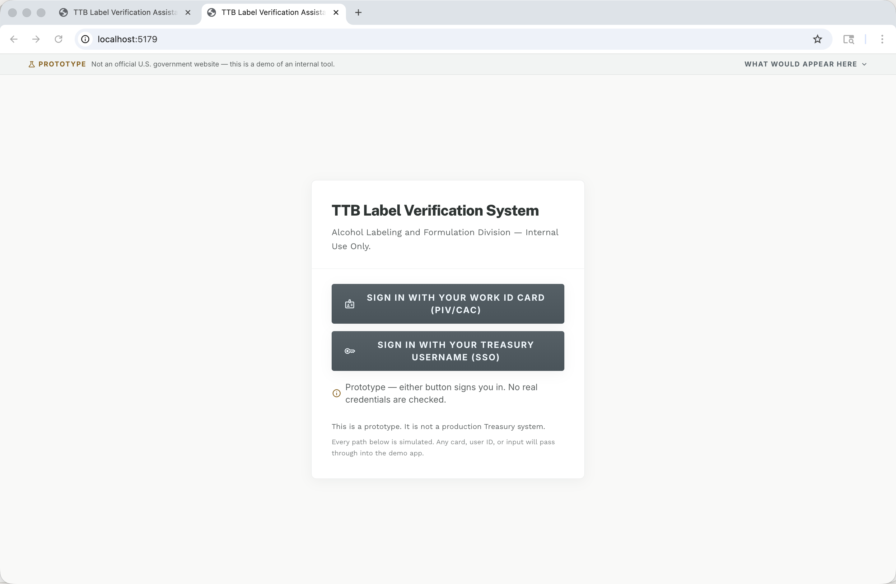
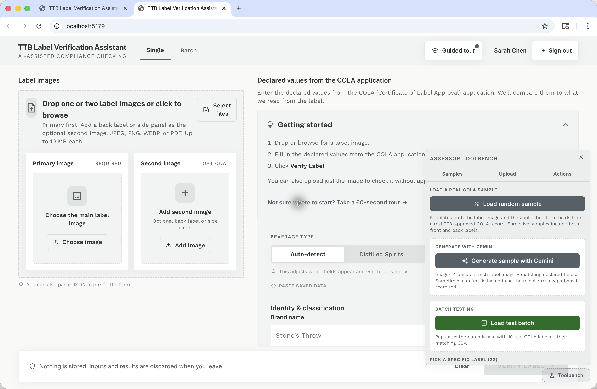
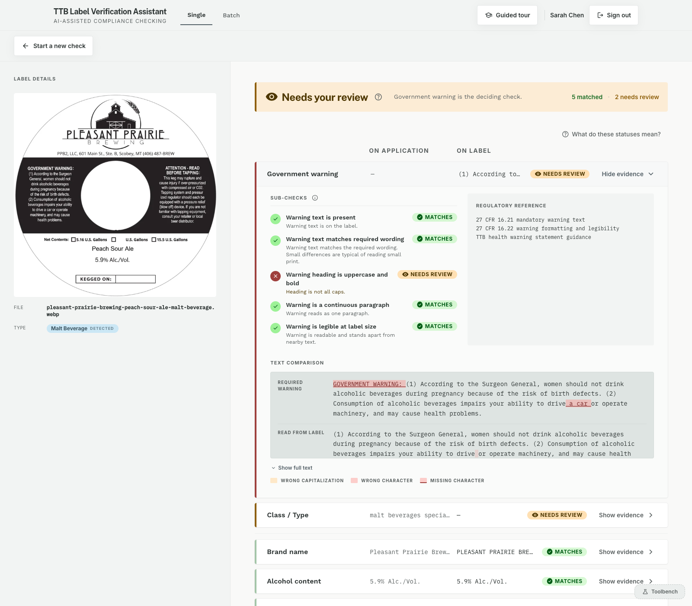
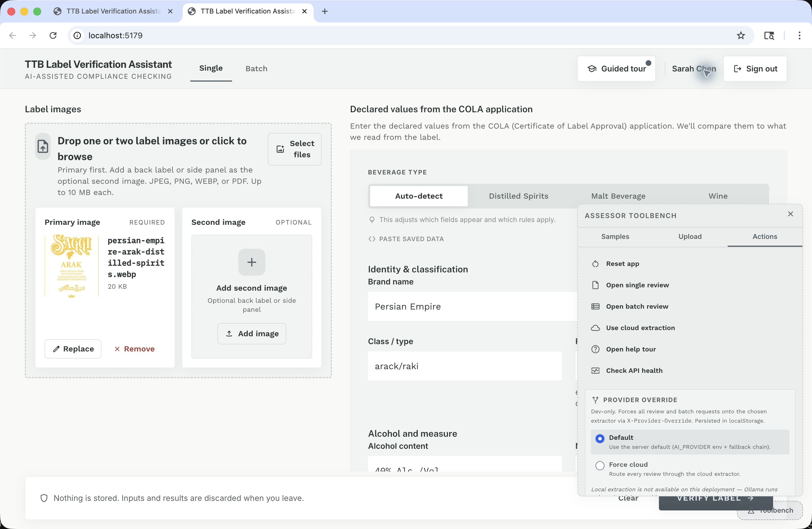
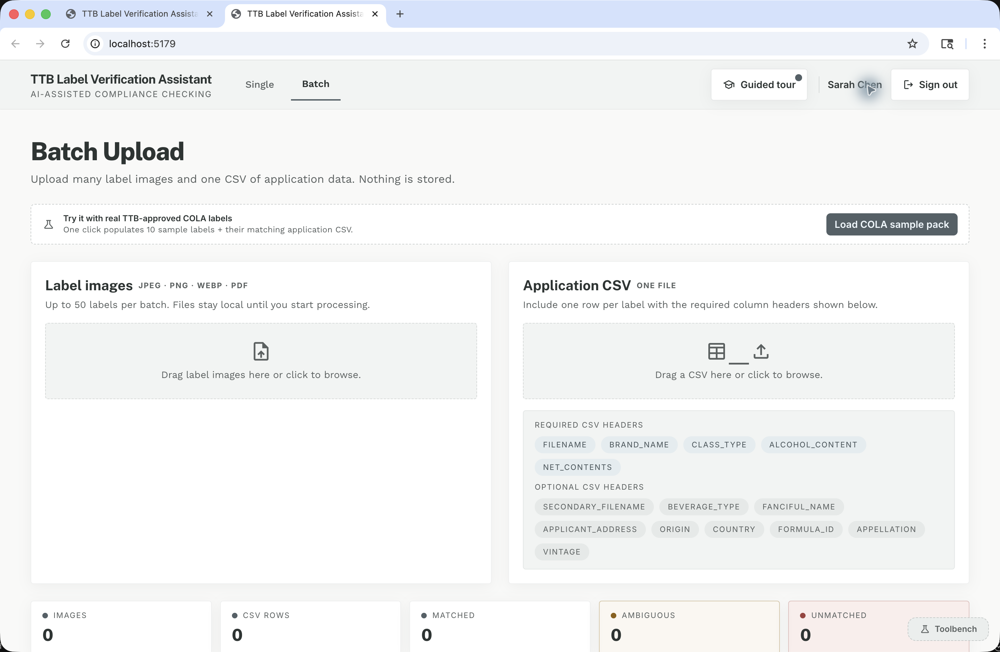

# Evaluator Guide

This is the shortest path through the prototype if you are assessing whether it is credible, fast enough, accurate enough, and documented like a serious internal tool rather than a one-off demo.

The lower-right `Toolbench` is the fastest way to get to the interesting surfaces without hunting through files by hand. It is an evaluator harness, not the core reviewer workflow.

What this guide is trying to surface:

- whether the UI feels trustworthy instead of theatrical
- whether warning evidence and deterministic checks are easy to inspect
- whether the app handles both “looks good” and “needs review” cases cleanly
- whether the repo has a believable dataset, benchmark, and deployment story behind the screenshots

If you only do one end-to-end pass, use a warning-heavy sample rather than a perfect label. The review path tells you more about the architecture than an all-green result.

## 1. Sign In

Use either mock sign-in button. No real credentials are checked in this prototype.

What to look for:

- the sign-in gate is lightweight and gets you into the product quickly
- the app makes it obvious this is a prototype
- the privacy posture is visible throughout the app: inputs and results are intended to be discarded rather than stored

## 2. Load A Known Single-Label Case With Toolbench

Open `Toolbench` in the lower-right corner, stay on `Samples`, and pick one of these:

- `Pleasant Prairie Brewing Peach Sour Ale` for a strong `Needs review` path with warning evidence
- `Harpoon Ale` for a cleaner “looks good” path
- `Fetch live sample` if you want to confirm the app can pull a fresh approved record from the COLA Cloud API

For the most revealing walkthrough, use `Pleasant Prairie Brewing Peach Sour Ale`.

Why this is the best evaluator path:

- the label image and declared COLA fields are populated together
- you can move straight to system behavior instead of spending time preparing files
- the sample list makes it easy to test multiple beverage types and edge cases quickly
- the COLA Cloud fetch path proves the demo is not limited to a tiny canned fixture list

## 3. Verify The Label And Watch Time-To-First-Answer

With a Toolbench sample loaded, click `Verify Label`.

What to watch for:

- the app can surface OCR preview data before the full review finishes
- the first useful answer lands before any silent cleanup work
- the latency question is not just total wall-clock time, but how quickly the reviewer gets something actionable on screen

If you want to inspect the network path directly, open browser devtools and watch for:

- `POST /api/review/stream?only=ocr`
- `POST /api/review`
- `POST /api/review/refine` only when review rows remain

## 4. Read The Results Screen

What to look for:

- the report is evidence-first rather than score-first
- uncertain rows stay visible as `Needs review` instead of being silently forced to pass
- the government warning row expands into sub-checks, text comparison, and citations instead of hiding behind one summary sentence
- when the refine pass is active, it improves borderline rows after the first answer instead of making the reviewer wait longer up front

This is the key trust interaction in the prototype: the first answer is fast, the evidence is inspectable, and any second-pass improvement is additive rather than blocking.

If you only inspect one expanded row, inspect `Government warning`. It is the clearest demonstration that the model is not making the compliance decision by itself.

## 5. Use Toolbench Actions To Check Runtime Posture

Open `Toolbench` and switch to `Actions`.

What to look for:

- `Reset app` clears state without a reload
- `Open single review` and `Open batch review` move between the two main workflows quickly
- `Check API health` gives an operator-friendly sanity check
- `Provider Override` is explicitly dev-only and exists to force cloud or local extraction during evaluation

If you are testing restricted-network posture, this is the quickest way to compare cloud and local extraction behavior without editing `.env` between runs.

## 6. Inspect The Batch Intake

Open batch mode either from the top nav or through `Toolbench -> Actions -> Open batch review`.

What to look for:

- the workflow is designed around many images plus one CSV, not one label at a time
- required CSV headers are visible in the UI, which reduces operator guesswork
- the batch surface keeps the file-matching and triage path separate from the single-label reviewer flow
- the footer and helper copy keep repeating the same privacy story: nothing is intended to be stored

## 7. Read The Supporting Evidence

If you are judging the engineering quality rather than only the UI, the next three docs are the highest-signal follow-up:

- [README.md](../README.md) for the repo-level abstract, architecture summary, process, datasets, and local-mode posture
- [ARCHITECTURE_AND_DECISIONS.md](ARCHITECTURE_AND_DECISIONS.md) for the detailed design and tradeoffs
- [EVAL_RESULTS.md](EVAL_RESULTS.md) for the benchmark evidence, false-reject families, and latency breakdowns

Those three documents explain how the project handled requirements that were explicit in the brief and requirements that had to be inferred: trust posture, reviewer guidance, latency perception, no-persistence behavior, dataset realism, cloud-versus-firewall constraints, and benchmark discipline.

## 8. A Good 5-Minute Assessment Script

1. Sign in with either prototype auth button.
2. Open `Toolbench -> Samples -> Pleasant Prairie Brewing Peach Sour Ale`.
3. Click `Verify Label`.
4. Confirm you get a useful first result before any silent cleanup or refine work finishes.
5. Expand `Government warning` and inspect the sub-checks, text comparison, and citations.
6. Open `Toolbench -> Actions -> Check API health`.
7. Use `Open batch review` and inspect the CSV header guidance.
8. Open the README and `docs/EVAL_RESULTS.md` to confirm the repo has benchmark and deployment evidence behind the UI.

That sequence exercises the reviewer flow, warning-evidence model, operator utilities, batch path, and the supporting documentation in a few minutes.
