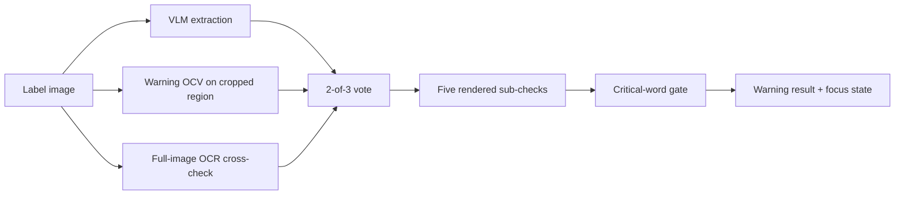
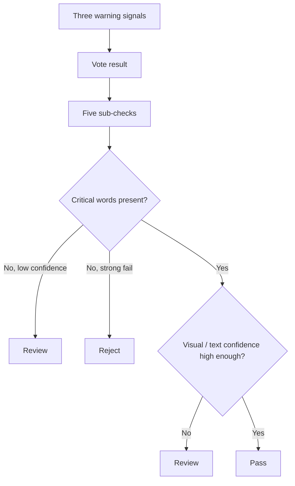

# Government Warning

The government warning is the most complex single check in the repository. It combines exact statutory wording, formatting requirements, uncertain image evidence, and a known failure mode in vision-language models: the same label can produce slightly different warning reads on different runs.

This document explains how the warning check is implemented today and where it is deliberately conservative.

Related documents:

- [docs/ARCHITECTURE_AND_DECISIONS.md](./ARCHITECTURE_AND_DECISIONS.md)
- [docs/REGULATORY_MAPPING.md](./REGULATORY_MAPPING.md)
- [docs/EVAL_RESULTS.md](./EVAL_RESULTS.md)

## 1. The Canonical Text

The canonical warning string lives in [`src/shared/contracts/review-base.ts:380`](../src/shared/contracts/review-base.ts).

> GOVERNMENT WARNING: (1) According to the Surgeon General, women should not drink alcoholic beverages during pregnancy because of the risk of birth defects. (2) Consumption of alcoholic beverages impairs your ability to drive a car or operate machinery, and may cause health problems.

That exact text is the source of truth for:

- the deterministic validator
- the warning diff UI
- the warning OCV verifier
- the critical-word gate

The warning path treats this as a compliance requirement, not a prompt hint.

## 2. Why The Warning Needs Its Own Architecture

The warning fails differently from other fields.

- It is long enough that OCR and VLM reads can drift by a few characters without the label actually being wrong.
- It has formatting requirements that are partly visual, not just textual.
- A front-only photograph may not include the warning at all, even when the label is compliant.
- The wrong answer is expensive. A false approval is a safety problem; a false reject destroys trust fast because agents know the warning text cold.

That is why the warning path is not "just another field judge." It has its own signal stack and its own verdict logic.

## 3. The Three-Signal Vote

The warning path uses three independent reads.

1. **VLM extraction** from the normal structured extraction pass
2. **Warning OCV** from [`src/server/validators/warning-region-ocv.ts`](../src/server/validators/warning-region-ocv.ts), which looks for the known warning text in likely warning regions
3. **Full-image OCR cross-check** from [`src/server/validators/warning-ocr-cross-check.ts`](../src/server/validators/warning-ocr-cross-check.ts)

The vote logic lives in [`src/server/validators/government-warning-vote.ts`](../src/server/validators/government-warning-vote.ts).

- pass threshold: `0.93`
- review threshold: `0.75`
- two passes -> effective similarity `1.0`
- two fails -> effective similarity `0.0`
- mixed outcome -> median similarity

This is the core defense against stochastic variance.

### Why this matters in practice

The checked-in eval logs show warning-driven false rejects clustering on the same small set of labels:

- `pleasant-prairie-brewing-peach-sour-ale-malt-beverage`
- `drekker-brewing-company-piano-necktie-malt-beverage`
- `harpoon-ale-malt-beverage`
- in some runs, `pilok-broumy-malt-beverage` and `1840-original-lager-...`

Those are not five unrelated failures. They are the same architecture problem repeating: one unstable warning read driving too much of the verdict. The vote reduces that failure mode by making the warning depend on agreement across multiple readers instead of the luck of one extraction.

See [docs/EVAL_RESULTS.md](./EVAL_RESULTS.md) for the run logs.

## 4. Warning OCV Is Verification, Not Extraction

The warning-region path deserves special treatment because it uses a different idea from the general VLM extractor.

The general extraction problem is:

"What text is on this label?"

The warning OCV problem is:

"Does this image region contain this exact known text closely enough to trust?"

That difference matters because verification is easier than open-ended reading. The code takes advantage of that.

### Current warning OCV flow

Implemented in [`src/server/validators/warning-region-ocv.ts`](../src/server/validators/warning-region-ocv.ts):

- use prepass OCR anchors when available
- try the bottom band first
- if no usable anchor is found, try rotated edge strips for wraparound warnings
- compare the recognized text against the canonical warning

This is why Harpoon-style wraparound cases have a chance to recover even when the warning is not in the first obvious crop.

## 5. The Five Rendered Sub-Checks

The shipped UI contract exposes five warning sub-checks, not eight.

The IDs are fixed in [`src/shared/contracts/review-base.ts:52`](../src/shared/contracts/review-base.ts).

1. `present`
2. `exact-text`
3. `uppercase-bold-heading`
4. `continuous-paragraph`
5. `legibility`

This is an intentional compression. The CFR contains more obligations than the UI renders as first-class rows. The repo chose a stable five-row evidence contract and grouped some visual obligations under the `legibility` umbrella.

### What each sub-check means

| Sub-check | Code path | What it means in practice |
| --- | --- | --- |
| `present` | `src/server/validators/government-warning-subchecks.ts` | the system found evidence that the warning exists |
| `exact-text` | same | the wording matches the canonical text closely enough |
| `uppercase-bold-heading` | same | the heading signal looks like `GOVERNMENT WARNING` rather than decorative or title-case drift |
| `continuous-paragraph` | same | the warning does not appear split into distinct blocks or bullets |
| `legibility` | same | the image evidence is good enough to trust the warning visually; this currently absorbs separation/contrast-style concerns |

### CFR obligations vs shipped sub-checks

| CFR obligation | Where it lands today | Status |
| --- | --- | --- |
| canonical text required | `exact-text` | implemented |
| heading must read `GOVERNMENT WARNING` | `uppercase-bold-heading` | implemented |
| heading in uppercase / bold | `uppercase-bold-heading` | implemented approximately from image signals |
| body not bold | grouped into visual confidence, not isolated | partial |
| continuous statement | `continuous-paragraph` | implemented |
| separate and apart from other information | grouped into `legibility` | partial |
| contrasting background / legibility | `legibility` | partial |
| minimum text size by container volume | no dedicated runtime rule | not implemented |

This distinction is important. The code is stronger than a naive text diff, but it is not yet a full Part 16 layout engine.

## 6. The Critical-Word Gate

After the sub-checks are built, the warning path applies an additional safety gate.

The critical words currently live in [`src/server/validators/government-warning-verification.ts:59`](../src/server/validators/government-warning-verification.ts):

- `GOVERNMENT`
- `WARNING`
- `Surgeon General`
- `women`
- `pregnancy`
- `birth defects`
- `impairs`
- `machinery`
- `health problems`

If these anchors are missing, the validator refuses to treat the warning as clean.

Two implementation details matter here:

1. this is a **safety gate**, not a broad fuzzy matcher
2. the gate is conservative about rejection

In the current implementation, low-confidence or partial critical-word absence tends to hold the warning in `review` rather than forcing a hard reject. That is why the warning path can stay strict without creating as many false rejects as a purely textual reject rule would.

## 7. Structured Focus States

The warning result is more expressive than the top-level verdict. It carries a `focus` state from [`src/shared/contracts/review-base.ts:68`](../src/shared/contracts/review-base.ts).

Current focus states:

- `verified`
- `verified-minor-noise`
- `verified-extra-text`
- `text-unclear`
- `formatting-check`
- `not-found`
- `partial-match`
- `missing-language`
- `incorrect-text`

These states let the UI and reviewer guidance distinguish different review tasks:

- `formatting-check` means "the words may be right; inspect the presentation"
- `text-unclear` means "the image evidence is weak"
- `partial-match` means "some of the warning is there, but not enough"
- `incorrect-text` means "the wording is genuinely off"

That is a much better fit for Jenny and Dave than a single flat `warning: fail`.

## 8. How The Validator Decides Pass / Review / Reject

At a high level:

In practice the repo is slightly more conservative than that diagram:

- the vote can create a strong fail
- the validator can still soften outcomes when the image likely does not contain the warning panel
- the scoring layer can downweight warning reviews so a front-only photo does not mechanically become a hard reject

That last step is implemented in [`src/server/validators/judgment-scoring.ts`](../src/server/validators/judgment-scoring.ts), not inside the warning validator itself.

## 9. Stochastic Variance: The Real Problem The Vote Solves

The warning vote exists because warning text was the main source of run-to-run instability in the corpus experiments.

Across the checked-in 2026-04-17 runs:

- `pleasant-prairie` flips between review and reject depending on whether the warning path overcommits
- `drekker` repeatedly lands in warning-driven reject outliers
- `harpoon` is the single most persistent warning false-reject case

That pattern shows the warning problem was not "Gemini is bad" or "OCR is bad." It was that any one of them could be wrong in a way that was too expensive to trust alone.

The 2-of-3 vote is the mechanical defense.

## 10. Image Preprocessing And Low-Contrast Warnings

The repository does some image handling for warning extraction, but not all the ideas discussed in planning documents are implemented yet.

### Implemented today

- OCR preprocessing path: grayscale, normalize, sharpen, optional upscale
- rotated warning crops
- bottom-band first strategy
- confidence-aware downgrade when image quality is weak

### Not implemented today

- blue-channel extraction for gold/yellow-on-white warning text
- explicit glare-classification pipeline
- perspective correction
- physical font-size measurement

So if someone is looking for a specialized "Saggi Arak" blue-channel rescue path, they will not find it in the runtime today. The architecture leaves room for it, but the checked-in code has not shipped that branch.

## 11. Worked Examples

| Scenario | Expected warning behavior | Why |
| --- | --- | --- |
| Canonical warning present and readable | `pass` / `verified` | text and visual checks align |
| Canonical warning plus extra trailing state language | usually `pass` / `verified-extra-text` | extra text is tolerated in the result model |
| Warning text mostly right but image too noisy to trust formatting | `review` / `formatting-check` or `text-unclear` | wording may be acceptable, but the evidence is not strong enough for approval |
| Missing `pregnancy` or `birth defects` language | usually `review` or `reject` depending on signal strength | critical-word safety gate fires |
| Front-only photo with no visible warning | `review`, not automatic reject | the system treats "not in this photo" as a valid uncertainty case |

## 12. Bottom Line

The government warning path embodies the repo's main architectural philosophy:

- use the model where it is useful
- cross-check it where it is fragile
- keep the final decision rule deterministic
- prefer `review` to false confidence

If the evaluator wants one subsystem that best demonstrates the engineering maturity of the project, this is the one. It is where the system stops being "OCR plus rules" and becomes a designed trust architecture.
