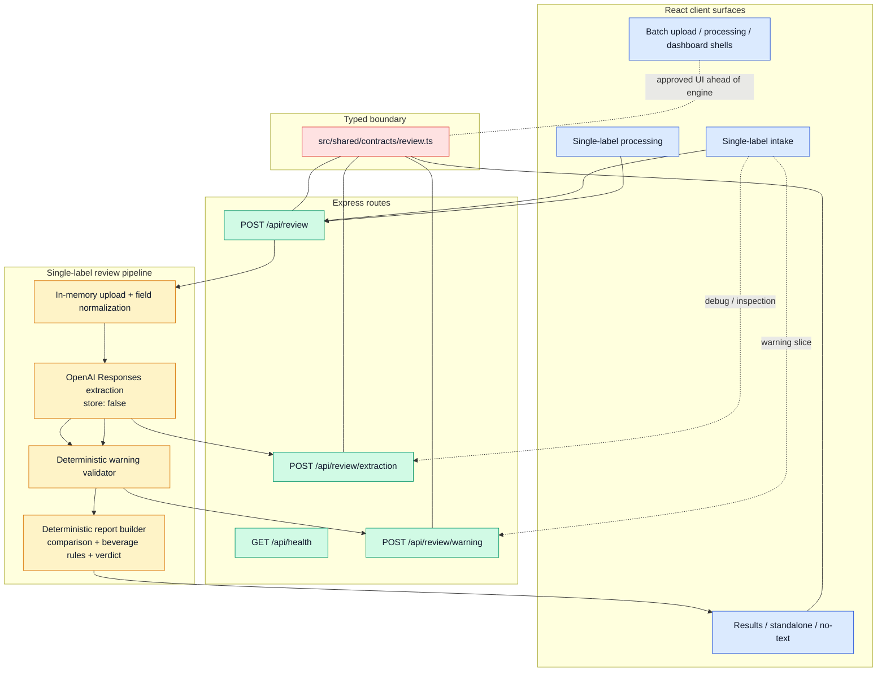
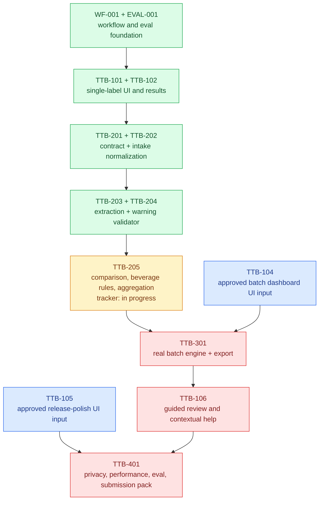
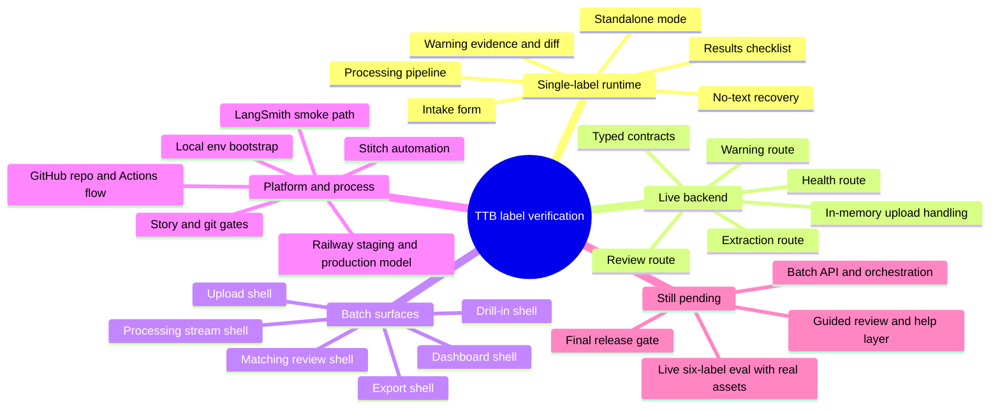

# Progress Review Report (PRR) - 2026-04-13

## Scope

This PRR summarizes the current workspace state for `ttb-label-verification` on 2026-04-13. It uses the checked-in tracker plus the current working tree as source material, so it reflects what has been built so far even where the tracker still marks a story as in progress.

Primary grounding:

- `docs/process/SINGLE_SOURCE_OF_TRUTH.md`
- `docs/specs/FULL_PRODUCT_SPEC.md`
- `docs/presearch/2026-04-13-foundation.md`
- `docs/backlog/codex-handoffs/TTB-101.md`
- `docs/backlog/codex-handoffs/TTB-102.md`
- `docs/backlog/codex-handoffs/TTB-103.md`
- `docs/backlog/codex-handoffs/TTB-104.md`
- `docs/backlog/codex-handoffs/TTB-105.md`
- `src/server/index.ts`
- `src/server/openai-review-extractor.ts`
- `src/server/government-warning-validator.ts`
- `src/server/review-report.ts`
- `src/shared/contracts/review.ts`

## Executive Summary

- The product is no longer just a scaffold. The repo now contains a full React + Express application with a typed shared contract, approved UI flows for single-label and batch work, and a live single-label backend pipeline.
- Single-label review is the most complete slice. Intake, processing, results, standalone mode, no-text handling, low-confidence handling, extraction, warning validation, and deterministic report shaping are all present in the current worktree.
- Batch work is visually far ahead of backend execution. Batch upload, matching review, progress, dashboard, drill-in shell, and export UI are implemented as approved shells, but the real batch API/orchestration remains deferred to `TTB-301`.
- Release and submission plumbing is also in place: repo process docs, GitHub/Railway deployment flow, local env bootstrap, LangSmith smoke path, Stitch automation, and story gates are all documented and wired into the harness.
- The main near-term gap is closure of `TTB-205` and alignment of tracker/doc status with the code that now exists in the worktree.

## Snapshot

| Area | Current state | Evidence |
| --- | --- | --- |
| Product architecture | Single-package Vite/React + Express with shared Zod contracts | `README.md`, `docs/specs/FULL_PRODUCT_SPEC.md`, `src/shared/contracts/review.ts` |
| Single-label UI | Intake, processing, results, standalone, no-text, warning evidence all implemented | `docs/backlog/codex-handoffs/TTB-101.md`, `docs/backlog/codex-handoffs/TTB-102.md`, `src/client/App.tsx` |
| Single-label backend | Live `/api/review`, `/api/review/extraction`, `/api/review/warning` routes | `src/server/index.ts` |
| Extraction | OpenAI Responses parse with `store: false`, structured output, image/PDF input support | `src/server/openai-review-extractor.ts` |
| Deterministic validation | Government warning validator and report builder with beverage-specific checks | `src/server/government-warning-validator.ts`, `src/server/review-report.ts` |
| Batch UX | Upload, matching review, processing stream, dashboard shell, drill-in shell, export shell | `docs/backlog/codex-handoffs/TTB-103.md`, `docs/backlog/codex-handoffs/TTB-104.md`, `src/client/Batch*.tsx` |
| Release/process harness | Story tracker, Git hygiene, Stitch automation, deployment flow, eval discipline | `docs/process/*.md`, `scripts/*.ts` |

## Built System Architecture

## Delivery Status by Story

## Product Surface Map

## What Exists Today

### 1. Single-label product slice

Built and visible in the current workspace:

- A full intake form with label upload, beverage hinting, optional application fields, origin toggles, wine-specific details, and privacy-first copy.
- A processing surface with five canonical steps:
  - `reading-image`
  - `extracting-fields`
  - `detecting-beverage`
  - `running-checks`
  - `preparing-evidence`
- A results surface that already understands:
  - `approve`, `review`, `reject`
  - warning evidence with ordered sub-checks
  - character-level warning diff segments
  - standalone mode
  - low-confidence extraction handling
  - no-text-extracted handling
  - cross-field checks

Key files:

- `src/client/App.tsx`
- `src/client/Intake.tsx`
- `src/client/Processing.tsx`
- `src/client/Results.tsx`
- `src/client/WarningEvidence.tsx`
- `src/client/WarningDiff.tsx`

### 2. Live single-label backend path

The current server wiring goes beyond a simple stub:

- `POST /api/review`
  - accepts one in-memory file plus optional JSON `fields`
  - normalizes intake
  - runs OpenAI extraction
  - runs the deterministic warning validator
  - builds a deterministic `VerificationReport`
- `POST /api/review/extraction`
  - exposes the typed extraction payload directly
- `POST /api/review/warning`
  - exposes the typed warning-check slice directly

Key files:

- `src/server/index.ts`
- `src/server/review-intake.ts`
- `src/server/openai-review-extractor.ts`
- `src/server/review-extraction.ts`
- `src/server/government-warning-validator.ts`
- `src/server/review-report.ts`

### 3. Deterministic compliance work already present

Implemented rule/report logic already in the worktree:

- cosmetic vs real field mismatches
- standalone `not-applicable` comparison handling
- distilled-spirits same-field-of-vision kept reversible as `review`
- wine vintage requires appellation
- malt beverage forbidden `ABV` format handling
- warning presence, exact-text, heading, continuity, and legibility sub-checks
- verdict aggregation based on fail/review/image-quality state

Key file:

- `src/server/review-report.ts`

### 4. Batch product surfaces already designed and implemented

The batch engine is not live yet, but the product surfaces are already built and approved:

- batch upload with separate image/CSV zones
- matching review with ambiguous, unmatched-image, unmatched-row, and matched groups
- batch processing stream with retry and cancel states
- batch dashboard shell with summary cards, filters, sort, and triage table
- drill-in shell that reuses the single-label results view
- export confirmation/progress/error shell

Key files:

- `src/client/BatchUpload.tsx`
- `src/client/MatchingReview.tsx`
- `src/client/BatchProcessing.tsx`
- `src/client/BatchDashboard.tsx`
- `src/client/BatchDrillInShell.tsx`
- `docs/backlog/codex-handoffs/TTB-103.md`
- `docs/backlog/codex-handoffs/TTB-104.md`

### 5. Process and deployment harness

This repo also has real delivery scaffolding, not just product code:

- checked-in story tracker and lane rules
- git hygiene gates
- Stitch automation flow
- LangSmith smoke test path
- local env bootstrap
- GitHub + Railway deployment model

Key files:

- `docs/process/SINGLE_SOURCE_OF_TRUTH.md`
- `docs/process/GIT_HYGIENE.md`
- `docs/process/STITCH_AUTOMATION.md`
- `docs/process/TRACE_DRIVEN_DEVELOPMENT.md`
- `docs/process/DEPLOYMENT_FLOW.md`
- `scripts/bootstrap-local-env.ts`
- `scripts/git-story-gate.ts`
- `scripts/langsmith-smoke-test.ts`

## Evidence of Validation So Far

- `TTB-201` eval: contract migration passes for seed, standalone, and no-text cases.
- `TTB-203` eval: extraction contract/helpers and route integration pass locally; live six-label run is blocked by missing binary assets.
- `TTB-204` eval: warning diff helper, warning route, full repo verification, and one live warning-route spot-check are recorded.

Evidence files:

- `evals/results/2026-04-13-TTB-201.md`
- `evals/results/2026-04-13-TTB-203.md`
- `evals/results/2026-04-13-TTB-204.md`

## Gaps, Risks, and Mismatches

### 1. `TTB-205` appears partially landed in code but not formally closed

The tracker still marks `TTB-205` as `in-progress`, but the current worktree already contains `src/server/review-report.ts` plus `/api/review` wiring that builds a deterministic report. The likely reality is that the runtime slice has progressed faster than the checked-in tracker/handoff state.

Impact:

- the code and tracker tell slightly different stories
- batch work remains blocked on paper even though some single-label aggregation code is already present

### 2. Batch backend remains the largest functional gap

Missing live capabilities:

- batch preflight
- batch matching API
- batch run orchestration
- batch retry
- batch summary/report/export endpoints

The UI is ready, but the engine behind it is not yet implemented.

### 3. Live eval completeness is blocked by missing assets

`evals/labels/manifest.json` exists, but the actual binary label files under `evals/labels/assets/` are still incomplete for live extraction/warning runs. That keeps end-to-end evidence weaker than the UI/backend progress might suggest.

### 4. Release gate remains open

Still pending before calling the POC submission-ready:

- final privacy audit
- full latency proof against the target path
- complete six-label eval run with real assets
- submission pack and release artifact assembly

## Recommended Next Moves

1. Reconcile tracker state with the code already present for `TTB-205`.
2. Close `TTB-205` with explicit tests/eval notes if the current deterministic report builder is the intended implementation.
3. Start `TTB-301` immediately after `TTB-205` is reconciled, using the already-approved `TTB-103` and `TTB-104` UI handoffs as fixed input.
4. Restore the missing label binaries under `evals/labels/assets/` and rerun the live extraction/warning slices.
5. Hold `TTB-401` until batch is real and the release-proof artifacts can be measured against the actual runtime.

## Bottom Line

The repo has moved well past scaffold stage. What exists today is:

- a real single-label reviewer application
- a real typed extraction/validation/report boundary
- a full approved batch UX awaiting engine work
- a delivery harness that is strong enough to support finishing the POC cleanly

The clearest remaining execution gap is not design or architecture. It is finishing, verifying, and formally reconciling the backend stories that are already partially represented in the worktree.
